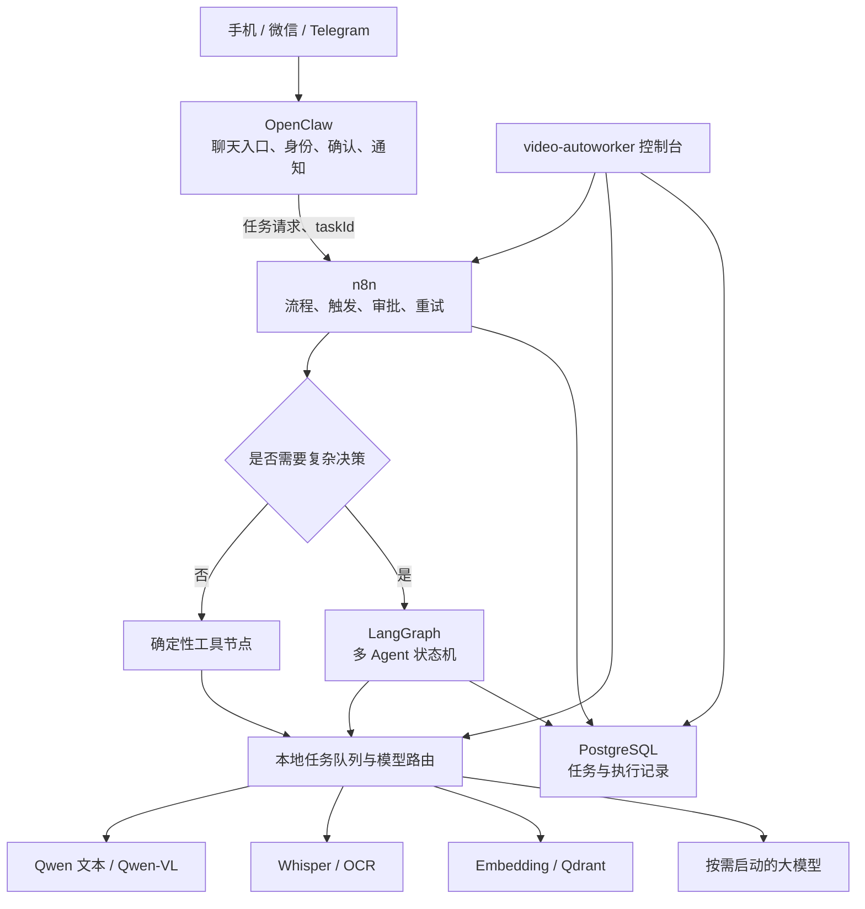

# AI-worker 2026 年 7 月技术工作计划

## 一、计划定位

本月工作围绕四条主线推进：升级千问模型、将 n8n 接入 AI-worker、建设专人专事的多 Agent 任务链，以及在可视化控制台中接入工作流和模型任务配置。

当前和后续均只使用一台 Mac Studio。因此本文中的“AI 集群”不是多机分布式推理集群，而是运行在单机上的逻辑多 Agent 协作系统和多模型服务池。系统通过明确的角色、输入输出协议和任务状态，将复杂任务拆分给不同 Agent 和模型处理。

截至 2026-07-25，本月仅剩一周。本月目标应以完成版本基线、总体设计和一条可运行的端到端任务链为主；完整的生产级实现预计延续到 8 月。

## 二、当前基础

- OpenClaw 已承担手机聊天入口、消息通道、Profile、工具调用和本地模型接入。
- 第二台 Mac Studio 已有 Qwen 文本/视觉、Whisper、视频学习流水线和 OpenAI 兼容接口的部署记录。
- Mission Control / video-autoworker 已具备任务、日志、Profile、素材等可视化页面。
- 现有控制台带有 LangGraph 和 CrewAI 的通用适配器，但还没有本项目自己的 LangGraph 任务图、n8n 工作流、Qdrant 服务或生产任务协议。
- 单机部署不需要 Kubernetes。模型服务继续采用原生 llama.cpp / MLX / Whisper 与 launchd；n8n、PostgreSQL 和 Qdrant 可作为独立控制面服务运行。

## 三、目标架构

职责边界如下：

- OpenClaw 负责对话入口、用户身份、任务确认、进度通知和结果投递。
- n8n 负责确定性的业务流程、定时任务、第三方接口、人工审批、超时和重试。
- LangGraph 只负责需要分支、循环、复核和中断恢复的 Agent 决策过程。
- 模型路由负责选择模型、限制并发、管理大模型互斥和按需启停。
- Qdrant 负责向量检索，不承担工作流状态或任务队列职责。
- video-autoworker 负责可视化配置、运行状态、日志和人工干预，不重复实现 n8n 的完整编辑器。

第一阶段不同时引入 CrewAI。OpenClaw、n8n、LangGraph 和 CrewAI 如果同时负责规划与重试，会形成多重调度和重复执行。优先以 LangGraph 作为唯一的复杂 Agent 状态机；后续只有出现明确的角色协作需求且 LangGraph 表达成本过高时，才单独评估 CrewAI。

## 四、工作项

### 0. 统一 GitHub 版本基线

这是后续四项开发的前置工作。

- 明确 `MAKingljx/video-autoworker` 为产品代码和远端部署的候选唯一主线。
- 将 `builderz-labs/mission-control` 定位为上游参考仓库，不在包含 91 个修改和 31 个未跟踪条目的工作树上直接继续堆功能。
- 对当前开发树差异进行分类：产品功能、上游改动、测试、运行时文件和临时产物。
- 将可交付功能按小提交迁移到产品仓库，通过分支和 Pull Request 审核。
- AI-worker 根目录继续作为本机运维工作区，不要求整体建立 Git 仓库；本机日志、运行态、缓存、备份、输出和日常工作记录不进入 GitHub。
- 只把远端生产实际依赖的核心源码、工作流定义、部署脚本、LaunchAgent 模板和 OpenClaw skills 迁入产品仓库并由 GitHub 管理。
- 远端部署只允许从产品 GitHub 仓库拉取已确认提交，不再通过本地同名目录或未提交文件直接覆盖。

验收标准：能够从 GitHub 的明确提交重建控制台和运维脚本，并能说明远端当前运行的是哪个 commit。

### 1. 升级千问模型

当前尚未指定准确的目标模型版本，因此先进行候选确认，不直接覆盖现有生产模型。

- 核对候选模型的官方权重、许可、文本/视觉能力、工具调用格式及 llama.cpp/MLX 兼容性。
- 在隔离端口启动候选模型，保留现有 Qwen 服务和配置作为回滚路径。
- 测试普通中文对话、长上下文、图片理解、结构化输出、真实工具调用和重复调用保护。
- 记录首 Token 延迟、生成速度、内存占用、上下文上限和长任务稳定性。
- 通过 OpenClaw Profile 做灰度验证，正式验收后再切换默认路由。

验收标准：升级前后有可比较的基准结果；出现失败时可在 10 分钟内恢复旧模型；OpenClaw、Telegram/微信和工具调用回归通过。

### 2. 将 n8n 接入 AI-worker

- 在本机部署 n8n，生产数据使用 PostgreSQL；n8n 编辑器默认只在本机或受控私网访问。
- OpenClaw 通过带鉴权的本地 Webhook 创建任务，立即返回 `taskId`，不让手机端同步等待长任务。
- 建立统一任务协议，至少包含任务 ID、用户、来源通道、输入类型、素材路径、工作流版本、优先级、超时、回调目标和幂等键。
- n8n 保存执行状态，支持失败重试、人工审批、取消和最终结果回调。
- 大文件只传受控路径或对象引用，不在工作流节点之间反复传输视频和音频二进制。
- 凭据存放在 n8n Credentials、Keychain 或环境变量中，不写入 GitHub。

验收标准：手机下发任务后两秒内收到任务编号；同一幂等键不会产生重复任务；执行成功、失败和取消都能回传 OpenClaw。

### 3. 建设专人专事的多 Agent 任务链

第一条任务链建议采用以下角色：

1. 调度 Agent：识别任务类型、拆分步骤并选择工作流。
2. 素材 Agent：负责 Whisper、OCR、Qwen-VL 和素材标准化。
3. 执行 Agent：完成领域分析、内容生成或工具操作。
4. 复核 Agent：检查事实、格式、遗漏、风险和质量门槛。
5. 发布 Agent：整理结果、生成附件并通知 OpenClaw。

每个 Agent 必须声明固定的输入 Schema、输出 Schema、可用工具、模型、超时、最大重试次数和失败处理方式。n8n 管理整个业务流程生命周期，LangGraph 管理单个复杂决策节点内部的状态；两者不得同时对同一执行步骤自动重试。

验收标准：至少有一条真实任务能够经过“下发—拆解—素材处理—执行—复核—回传”完整闭环，并能从日志中追踪每个 Agent 的输入、输出和耗时。

### 4. 在可视化页面接入 n8n 和模型任务配置

第一阶段不直接用 iframe 嵌入完整 n8n 编辑器。控制台提供符合 AI-worker 需求的管理页面，并通过受控链接进入 n8n 原生编辑器。

可视化页面至少包括：

- 工作流列表、版本、启用状态、n8n workflow ID 和最近执行结果。
- 可视化任务链，展示 Agent、模型、工具和前后依赖关系。
- 每个节点的模型、提示词模板、工具白名单、输入输出 Schema、超时、并发、重试和人工审批配置。
- 模型服务状态、当前队列、占用内存、运行任务和按需启停状态。
- 执行历史、节点日志、失败原因、重新运行和取消入口。
- 工作流配置导入导出；非敏感定义以 JSON/YAML 进入 GitHub，密钥不进入仓库。

验收标准：管理员能够在页面上选择工作流、调整一个节点的模型与超时、保存新版本、触发测试运行，并查看完整执行链。

## 五、本月安排

### 2026-07-25 至 2026-07-31

- 完成本计划、Git 仓库审计和主代码线选择。
- 整理开发树的未提交差异，形成迁移清单，不直接批量提交到上游仓库。
- 完成 n8n + PostgreSQL 的本地部署方案和一个 OpenClaw Webhook 原型。
- 确定千问升级候选与隔离测试矩阵，完成至少一次独立端口启动验证。
- 定义统一任务协议和五类 Agent 的输入输出 Schema。
- 完成可视化工作流页面的信息架构、接口清单和数据模型草案。

本月不把以下内容作为强制完成项：生产模型正式切换、完整多 Agent 平台、完整可视化流程编辑器和多人生产发布。这些工作需要在原型验证后继续推进。

### 后续预计工期

| 阶段 | 预计工期 | 主要交付 |
|---|---:|---|
| 端到端原型 | 5～7 个工作日 | OpenClaw → n8n → 本地模型 → 手机回传 |
| 内部可用版本 | 3～4 周 | LangGraph、多 Agent、Qdrant、任务状态和基础可视化 |
| 稳定版本 | 6～8 周 | 模型调度、失败恢复、权限、监控、备份和完整回归 |

以上按一名熟悉现有项目的工程师全职投入估算，不包括自研手机 App，也不包括多机分布式推理。

## 六、主要风险

- 当前开发源码与部署仓库分属不同 Git 历史，必须先统一版本基线。
- `aiworker-second-storage` 的参数拼接和视频索引覆盖已有视觉标注属于接入自动工作流前必须处理的高风险问题。
- 单机没有高可用，系统升级、重启和硬件故障会影响全部控制面与模型服务。
- 多个大模型可以放入 512GB 内存，但不能默认同时满负载推理；需要单并发队列和互斥调度。
- n8n 编辑器、Webhook 和模型端口不能直接暴露公网；公网入口仍由 OpenClaw 通道承担。
- 模型升级不能只验证“服务能启动”，必须验证真实推理、视觉、工具调用、长任务和回滚。

## 七、当前 GitHub 状态

截至 2026-07-25，并非所有内容都已经通过 GitHub 版本控制：

| 范围 | GitHub 状态 | 当前情况 |
|---|---|---|
| AI-worker 根工作区 | 未纳入 Git | `docs/`、`scripts/`、`memory/` 等没有独立 Git 仓库 |
| Mission Control 开发树 | 已配置 GitHub，但未同步 | 本地 `4ef91d4`，GitHub `main` 为 `f17aaa2`；本地有 91 个修改和 31 个未跟踪条目 |
| 本地 video-autoworker 镜像 | 已同步 GitHub | 本地、`origin/main` 和 GitHub 均为 `d18c6ce`，工作树干净 |
| 远端运行仓库 | 代码提交已同步 GitHub | 远端 HEAD 与 GitHub 均为 `d18c6ce`；另有 `.runtime/`、`pnpm-workspace.yaml` 和一个历史 `.bak` 未跟踪 |

因此，当前只有 `video-autoworker` 产品代码形成了清晰的 GitHub 发布线。AI-worker 根目录保持本机非 Git 工作区符合当前约定；需要继续处理的是 Mission Control 工作树中尚未迁移的产品改动，以及远端生产实际依赖但仍只存在于本机工作区的脚本和配置。
