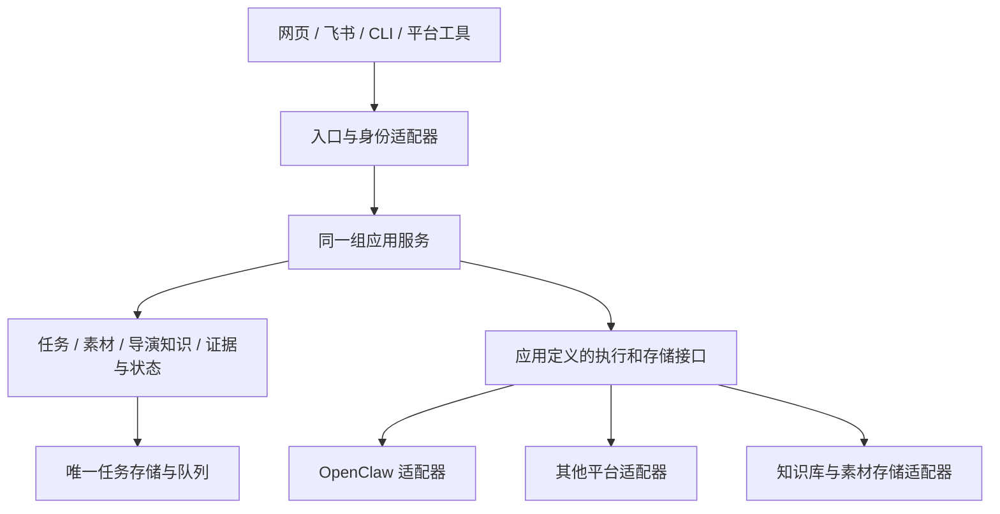

# AI-worker 平台无关核心与接入边界

## 决策

AI-worker 的任务、素材、导演知识、状态权威和发布一致性属于应用自身。OpenClaw 是当前使用的身份入口和执行平台适配器；后续可通过替换适配器接入其他平台。替换平台时复用同一应用服务、任务标识和持久队列，不能为每个平台建立另一条业务链。

本决策来自 2026-09-07 用户新增要求：设计要通用，后续摆脱 OpenClaw 也能接入其他平台。它明确了未来可替换目标；本次恢复部署仍使用经过验证的 OpenClaw 9.2、当前单一身份边界和停用的视频 lane。未来切换身份提供方时仍保留一个外部身份权威，不并行增加第二套账号或长期共享用户密钥。

## 边界与数据所有权

| 边界 | 应用负责 | 平台适配器负责 |
| --- | --- | --- |
| 身份入口 | workspace、业务权限、操作归属与审计 | 校验平台身份并映射成应用身份；处理平台凭据 |
| 会话与消息 | 消息请求、请求幂等键、会话操作语义 | 平台会话 ID、协议调用、SDK 差异、结果与错误转换 |
| 任务执行 | 创建、队列、状态机、重试政策、取消语义、派发资格 | 提交与查询执行、取消请求、心跳、回调格式转换 |
| 素材与结果 | asset ID、版本、校验摘要、权限、证据时间码 | 物理存储、受控文件访问、对象存储或平台上传协议 |
| 导演知识 | 作品、人物、事件、判断、候选与批准状态、版本 | 飞书或后续知识存储的查询与持久化协议 |
| 发布 | 准入、排空、lease、release affinity、回退与验证 | launchd、容器或平台部署命令；平台健康与版本取证 |

核心代码不能读取平台配置文件、拼接平台 CLI、解析平台 session key、解密平台凭据或依赖平台私有状态枚举。应用 ID 与平台 ID 分开；平台引用应带 provider ID、适配器版本和不透明外部 ID，不把 OpenClaw agent/session 字符串当作业务主键。

一个任务只保存一个明确的执行归属；重试保留同一业务幂等键，跨平台重新派发必须形成显式迁移决策。适配器返回“已接收”不等于任务已完成；重复、迟到或乱序回调仍进入同一状态校验。取消、流式输出、附件、压缩、工具调用等能力必须单独声明并验收，不支持时返回明确错误，不能静默切到另一个平台。

## 现有实现与本次落地

`src/lib/runtime/contracts.ts` 现在单独保存应用拥有的会话合同，无 OpenClaw SDK 或配置依赖。`src/lib/runtime/registry.ts` 保存平台工厂的固定快照，按身份惰性创建并复用实例；未知、离线或身份不符的选定平台直接失败，不回落到其他平台。

`src/lib/runtime/providers/openclaw.ts` 封装已有 OpenClaw CLI、Gateway 方法及版本兼容行为。`src/lib/runtime-provider.ts` 只作为组合入口，保持已有调用接口，并集中选择当前生产适配器。接入新平台时实现同一合同，在组合入口登记并选择工厂；会话应用服务无需再引用该平台 SDK。生产组合本轮继续固定 OpenClaw，避免仅改一个环境变量便使部分业务切换平台、其余任务仍在旧平台执行。

替代适配器测试在 OpenClaw 工厂明确抛出“未安装”时，完成消息提交、幂等键传递和执行等待，且不创建 OpenClaw 实例；另验证未知平台、不可用平台、身份不符及外部工厂表篡改。该证据证明会话边界可替换，不代表已接入或验收某个第三方平台。

本次 9.2 `agents.entries`、SecretRef、Gateway 状态 DTO 与工具目录兼容属于 OpenClaw 适配器的维护责任。既有恢复脚本路径因不可变来源与恢复凭据绑定保留；不能为目录美观移动历史源码或绕过发布合同。

## 2026-09-08 维护约定与共享入口

用户进一步明确：尽量少修改 OpenClaw 基础代码，把业务对接问题集中在我方适配层。本轮不修改 OpenClaw 核心或 npm dist。官方配置与 SDK 能解决的问题采用官方入口；平台版本、会话格式、工具调用和返回结构差异在适配层归一化，业务规则继续由同一应用服务负责。

| 维护事项 | 唯一入口 | 验证方式 |
| --- | --- | --- |
| 会话能力、列表、历史与受控删除 | `src/lib/runtime/contracts.ts` 与 `runtime/providers/openclaw.ts`；应用通过 `runtime/sessions.ts` 读取 | provider 合同及 API 定向测试；读取失败明确 unavailable，不能当成空会话 |
| Gateway 托管健康与浏览器连接 | `src/lib/gateway-connection-state.ts`；`use-managed-gateway-health.ts` 执行只读探测 | DTO、selector、轮询策略和凭据边界测试 |
| OpenClaw agent CLI 结果 | `scripts/lib/openclaw-agent-json-result.mjs` | 本地执行/Gateway 包装、成功终态、模型身份与外送负例 |
| 工具调用与结果配对验收 | `scripts/lib/openclaw-rich-canary-contract.mjs`；隔离执行观测由 `openclaw-canary-tool-observer.mjs` 提供 | 原始执行参数与脱敏持久化分开验证，按调用摘要绑定同一轮成功结果 |
| 真实对话验收 | `pnpm qa:dialogue --config /绝对路径/私有inputs.json` | 每次一个自有合成会话、实际配置与版本绑定、官方 CAS 清理、脱敏报告 |
| 本地及 CI 的 QA 合同测试 | `pnpm qa:contracts` | 共用一份测试入口；变更影响之外的已验证证据继续复用 |

托管 Gateway 的健康状态不代表浏览器建立了 WebSocket。界面与轮询统一消费 selector：托管模式仍通过 HTTP 取数，实际浏览器 WebSocket 才能替代相应轮询。选择或探测失败不能写入虚假的已连接状态，也不能将 Gateway 凭据交给浏览器。

每次发布保留独立、不可变的代码与制品版本；主机路径、运行输入和报告存放在私有目录。验收代码固定纳入 Git，后续只替换一次运行的配置，不复制新的测试实现。历史恢复脚本及收据继续按原绑定保留，常规更新使用既有蓝绿发布入口。入口按安装记录解析现役服务管理器，不假设发布仓库就是安装仓库；自有 launcher/auditor 升级先验证旧安装的完整 Git 与文件绑定，在服务停止后 CAS 更新并保留备份，历史源码不原地修改。新审计器同时接受已验证的旧应用制品，保留回滚能力。

## 仍需迁移的耦合点

| 现有位置 | 当前事实 | 后续迁移方式 |
| --- | --- | --- |
| 会话合同和 chat 调用方 | 兼容保留 `sessionKey`、`raw` 与部分旧响应解析；列表、历史、统计及受控删除已归入运行时适配器；消息发送与部分控制响应仍保留兼容字段 | 逐步改为不透明 session 引用、规范化 text/tool/error 结果及能力声明，原始平台 DTO 只留适配器；注册表可替换不等于整个聊天流程已脱离平台 |
| `src/lib/task-dispatch.ts` | 普通任务派发仍直接调用 OpenClaw，且包含直接模型请求和模型路由 | 提取 TaskExecutionPort；模型选择留在策略层，平台调用和 DTO 解析进适配器 |
| `src/lib/agent-sync.ts` | 当前代理目录来源仍为 OpenClaw 配置；新旧配置布局已共享处理 | 提取 AgentDirectoryPort；把平台外部 ID 映射为应用 agent ID，保留旧 openclawId 的读取兼容 |
| `src/lib/auth.ts` 与 loopback 边界 | 生产外部身份仍统一来自 OpenClaw | 提取可信 IdentityContext；新平台完成身份映射与负例验收后一次性替换外部权威 |
| `src/lib/adapters/` | 含多个框架名，主要为注册、事件和任务上报适配，并非完整执行引擎 | 与执行端口分工明确；不能仅据框架名声明支持该平台 |
| n8n 任务链与 OpenClaw 工具 | 现有唯一视频链含平台工具和执行回调绑定 | 从当前链抽出任务提交和执行接口，复用原队列、状态及 release affinity，不增加影子派发链 |
| 飞书导演脑 | 知识语义独立，持久化协议仍依赖飞书 | 提取 KnowledgeRepository，保留素材证据引用、候选审批和版本语义 |

## 迁移顺序与验收

1. 本轮完成会话接口隔离、可替换组合测试和当前应用恢复后的正常发布；现有数据库主键与迁移历史保持兼容。
2. 后续围绕同一应用服务逐个迁移任务执行、代理目录和身份接口。每个接口保留一套当前业务逻辑，调用方迁完后清理失去调用方的旧实现。
3. 用户选定第二个平台后，使用真实平台侧装验证注册、消息、任务提交、幂等重试、回调乱序、取消、附件、权限拒绝、超时和平台不可用场景。提供者不支持的能力必须明确呈现。
4. 在无 OpenClaw 二进制、配置目录、Gateway 与凭据的隔离环境运行真实端到端任务；确认业务数据可读、同一任务状态与结果可恢复。完成这一项，才可声明相应业务已脱离 OpenClaw。
5. 实际平台切换先暂停新准入，保留进行中任务的原平台与 release 归属，排空后退役旧平台；不得在任务执行中途热改 provider 默认值。数据库迁移、身份切换和生产启用分别按具体影响确认。

当前发布不引入新的数据库、任务状态机、平台账号或公开网络入口。未来可替换性通过稳定业务合同、平台适配器和真实脱离环境验收建立，而非通过重命名现有平台字段建立。

应用的 OpenClaw doctor 修复入口只调用官方 doctor --fix 并复查，不再附带强制 session cleanup 或自行识别、归档孤立历史文件。批量历史清理必须由提供者声明能力；当前适配器明确不支持，界面和调度器不得静默执行文件删除。
