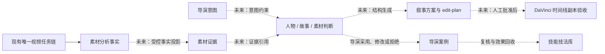

# 导演脑架构与接入边界

## 文档状态

本文描述 Video AutoWorker 项目内“导演脑”的目标架构、飞书云端基础设施、数据契约与分阶段接入边界。当前已经完成独立测试飞书账号下的自建应用、多维表格和真实 API 验收，但尚未接入真实素材自动入库、自动故事脚本生成或 DaVinci 实机剪辑。生产事实仍以对应提交和带时间戳的运维记录为准。

## 核心定位

导演脑不是普通 AI 问答系统，也不是第二套素材检索或视频任务系统。它是 Video AutoWorker 内面向纪录片创作的长期知识与导演决策子系统，用于把素材分析结果进一步组织为人物认知、故事关系、导演判断、叙事方案和可复核的导演经验。

导演脑在飞书侧使用独立测试账号、独立自建应用、独立多维表格和独立凭据服务，与现有飞书工作大脑隔离；但其逻辑项目身份仍是 `PROJ-VIDEO-AUTOWORKER`，不创建第二个项目，也不复制现有任务链。

目标工作流为：

`观察 -> 理解 -> 建立人物认知 -> 发现故事 -> 判断素材 -> 建立叙事 -> 形成表达`

系统不仅回答素材中有什么，还需要在证据可追溯的前提下回答素材为什么重要、人物如何变化、是否存在冲突或转折、镜头适合放在哪里，以及不同排列会产生什么叙事效果。

## 当前实现边界

当前已完成的是导演脑云端基础设施：

- 独立飞书自建应用已经发布 `1.0.0`；
- 独立“导演脑”多维表格已经创建；
- 10 张领域表及字段契约已经通过真实飞书 API 核验；
- 8 条系统蓝图已经按稳定 ID 写入并精确回读；
- API 临时记录创建、更新、删除均成功，清理后残留为零；
- 凭据模式扫描和本地 schema 契约测试通过。

当前没有实现或声明以下能力：

- 真实素材分析结果自动写入导演脑；
- 跨素材人物模型的自动持续更新；
- 自动生成可交付故事脚本；
- 自动生成并执行 DaVinci 时间线；
- DaVinci 或其他剪辑软件的实机 AI 能力集成；
- 导演脑独立维护任务状态、任务队列或媒体处理链。

## 六层导演认知模型

| 层级 | 目标 | 主要飞书投影 | 输出约束 |
|---|---|---|---|
| 素材感知层 | 理解人物、地点、行为、时间、声音、镜头语言、画面和 OCR | 素材证据 | 必须带来源素材 ID、时间码、分析版本和置信度 |
| 人物理解层 | 建立身份、目标、欲望、恐惧、性格、关系、矛盾、情绪变化和人物弧光 | 人物档案 | 跨素材、跨日期版本化，不覆盖历史判断 |
| 故事发现层 | 识别事件、冲突、转折、悬念、人物变化、因果和未解决问题 | 故事节点、故事关系 | 高层关系必须回链到证据 ID，并保留判断理由 |
| 导演判断层 | 评价故事、人物、情绪、信息、视觉、稀缺性和叙事价值 | 素材判断 | 除分值外必须说明为什么值得使用及不同位置的效果 |
| 叙事结构层 | 组织人物线、事件线、时间线、地点线、情绪线、主题线和冲突线 | 叙事方案 | 方案必须引用意图版本、故事节点和素材证据 |
| 导演意图层 | 定义核心主题、导演态度、核心人物、风格、叙事方式、节奏和观众体验 | 导演意图 | 所有判断和方案必须明确引用生效的意图版本 |

六层模型是认知层次，不是六条并行执行链。它们共享同一组稳定领域 ID 和证据引用，最终仍通过 Video AutoWorker 唯一视频任务链取得素材分析事实。

## 十表数据模型

| 表 | 职责 | 稳定 ID |
|---|---|---|
| 系统蓝图 | 保存定位、目标、架构、开发逻辑、数据边界、集成边界和验收规则 | 规范 ID |
| 导演意图 | 版本化保存作品主题、态度、风格、节奏和观众体验 | 意图版本 ID |
| 素材证据 | 保存来源引用、时间码和结构化素材观察 | 证据 ID |
| 人物档案 | 保存可跨日期更新的人物长期模型 | 人物版本 ID |
| 故事节点 | 保存事件、冲突、转折、悬念和未解决问题 | 节点 ID |
| 故事关系 | 保存节点之间的因果、时间、对照、升级、呼应和解决关系 | 关系 ID |
| 素材判断 | 保存七类价值判断、使用理由和位置建议 | 判断 ID |
| 叙事方案 | 保存七条叙事线、结构说明、故事脚本和未来剪辑方案引用 | 方案 ID |
| 导演案例 | 保存导演动作、原因、上下文、最终使用位置和效果 | 案例 ID |
| 技能技法库 | 从复核案例中提炼适用条件、执行方法、原理和例外 | 知识 ID |

飞书记录 ID 只属于飞书存储实现，不能充当业务 ID。已经存在的 `taskId`、`batchId`、`materialId`、`sceneId` 和 `shotId` 必须原样作为来源引用；导演脑只为人物版本、故事节点、关系、判断、意图、方案、案例和技法创建稳定领域 ID。

## 数据流与单链边界

图中的虚线均为后续接入阶段，不代表当前已运行。导演脑不得直接读取或改写任务数据库，不拥有任务状态机、队列、重试、取消、重提或媒体处理副作用。素材处理状态仍由现有平台和 SQLite 权威链管理；飞书只保存长期知识、判断和来源引用。

## 核心数据原则

### 证据优先

任何人物、故事、冲突、转折或叙事判断都必须能够回链到素材 ID、场景或镜头 ID、起止时间码和分析版本。模型推断不能覆盖原始事实；低置信度或尚未人工复核的内容保持候选状态。

### 意图控制

导演意图采用不可变版本引用。素材判断和叙事方案必须记录生成时使用的意图版本，后续意图变化产生新版本，不静默改写既有判断。

### 解释优先

素材价值不能只保存标签或分值。判断必须同时记录使用理由、建议位置和放在不同位置可能产生的叙事效果，以便导演复核和后续学习。

### 学习“为什么”

导演经验闭环为：

`原始素材 -> 导演判断 -> 判断原因与上下文 -> 采用/修改/拒绝 -> 成片位置 -> 最终效果 -> 案例复核 -> 技法提炼`

技能技法库学习的是判断条件、执行方法、为什么有效和例外情况，而不是把“镜头最终被使用”当成唯一训练信号。

### 版本与人工门禁

人物档案、导演意图、判断、方案、案例和技法均保留版本与状态。自动生成内容先进入候选或待审核状态；只有经过人工确认的内容才能成为后续高层决策的默认依据。

## 安全与存储边界

飞书只保存结构化知识及受控引用，包括导演意图、人物、故事、判断、叙事、案例、技法、素材 ID、证据时间码、分析版本和置信度。

以下内容不得进入导演脑多维表格或 Git：

- 原始视频、逐帧图片和完整原始转写；
- 向量、模型权重、运行日志、数据库和任务状态机；
- App Secret、访问令牌、密码、私钥或其他凭据；
- 包含敏感本机路径、会话正文或认证信息的原始输出。

真实 App Secret 只保存在独立 Keychain 项中；本地飞书资源目录保存在仓库外的权限受控文件中。仓库仅保存无密钥 schema、维护 CLI、测试和脱敏记录。

Next.js standalone 构建还会执行成员审计，禁止把 `.PhoenixBrain`、`.git`、任意大小写及扩展形式的 `.env*`、常见包管理凭据文件、私钥文件或导演脑本地 catalog 带入构建输出。该机制只约束独立输出边界，不删除项目根的私有路由标记。

## 云端维护工具

仓库提供 `director-brain` CLI，用于对独立导演脑执行可审计操作：

- `schema`：离线检查无凭据 schema；
- `bootstrap`：先只读预检已有 Bitable，再创建或补齐多维表格与字段；
- `check`：精确核验远端 10 表字段契约；
- `seed`：按稳定 ID 幂等写入系统蓝图；
- `verify`：精确回读系统蓝图并执行敏感模式检查；
- `write-check`：创建、更新、删除临时记录并确认零残留。

工具对项目、环境、脑名称、应用身份和表目录进行一致性校验；已有 Bitable 的额外表、额外字段、额外选项、重复稳定 ID、字段类型不匹配或敏感字段会在修复写入前失败关闭。它不是运行时素材同步器，也不提供通用任意表写入入口。

## 分阶段接入计划

### 阶段一：素材事实投影

从现有正式分析结果生成最小、幂等、可回溯的“素材证据”投影。先定义字段映射、时间码规范、稳定证据 ID、重放与冲突策略，再在隔离数据上验证；不得从飞书反向驱动任务状态。

### 阶段二：人物与故事发现

在证据投影稳定后，按作品和人物版本建立人物档案、故事节点与故事关系。所有推断保留置信度、证据引用和人工审核状态。

### 阶段三：导演判断学习

引入导演意图版本和素材七维价值判断，记录导演采用、修改或拒绝的原因及上下文，形成可复核导演案例。

### 阶段四：叙事与 edit-plan

在已确认事实、人物和故事节点上生成候选叙事方案及机器可校验的 edit-plan。输出只作为建议，必须通过引用完整性、时间码范围、素材存在性和人工批准门禁。

### 阶段五：DaVinci 实机集成

只在目标 DaVinci 版本和正式接口经过实机验证后接入。先对时间线副本执行最小编辑操作，验证幂等、媒体离线处理、撤销和导出；复杂 AI 剪辑能力必须逐项测试后才能声明可用。导演脑不得直接对唯一工作时间线进行未经批准的破坏性编辑。

## 验收口径

导演脑阶段性能力只有同时满足以下条件才可声明完成：

1. 领域记录具备稳定 ID、版本、状态和项目隔离；
2. 高层判断可回链到素材证据与时间码；
3. 飞书表结构、种子内容和写入权限通过真实 API 验证，而不只依赖浏览器页面；
4. 临时写检查完成创建、更新、删除并证明零残留；
5. schema、目录和输出均不包含凭据或禁入数据；
6. 接入不复制现有视频任务链，不改变平台状态权威；
7. 本地候选、飞书测试环境、隔离集成和生产事实分开记录；
8. DaVinci 能力必须提供目标版本实机证据，不能从 schema 或接口设想推断。

当前仅满足独立飞书云端基础设施及其真实 API 验收，不代表素材自动入库、自动脚本生成或自动剪辑已经完成。
