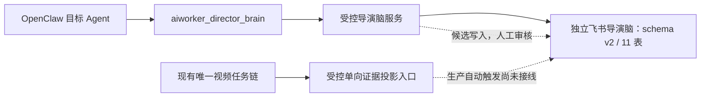

# 导演脑架构与接入边界

## 文档状态

本文描述 Video AutoWorker 项目内“导演脑”的目标架构、飞书云端基础设施、数据契约与分阶段接入边界。当前独立测试飞书环境已经迁移到 schema v2，共 11 张表，并通过真实 API、六层验收样片和审核引用闭环验收。OpenClaw 已具备 7 个受控动作：`health`、`resolve_work`、`get`、`search`、`assemble`、`workflow`、`propose`；此前已验收版本曾安装到本机 `dev` profile，“不提供 ID、只说片名或别名”的自然语言六层问答已完成本机验收，用户可见答案没有内部 ID，也没有补造事实。剪辑执行当前明确冻结；非剪辑能力仍分为本地候选、飞书测试闭环和待生产化能力。当前工作树新增的媒体身份、可恢复暂存、安装器和 standalone 部署加固尚未发布到远端，生产仍运行 `542eebd-runtime`。

## 核心定位

导演脑不是普通 AI 问答系统，也不是第二套素材检索或视频任务系统。它是 Video AutoWorker 内面向纪录片创作的长期知识与导演决策子系统，用于把素材分析结果进一步组织为人物认知、故事关系、导演判断、叙事方案和可复核的导演经验。

导演脑在飞书侧使用独立测试账号、独立自建应用、独立多维表格和独立凭据服务，与现有飞书工作大脑隔离；但其逻辑项目身份仍是 `PROJ-VIDEO-AUTOWORKER`，不创建第二个项目，也不复制现有任务链。

目标工作流为：

`观察 -> 理解 -> 建立人物认知 -> 发现故事 -> 判断素材 -> 建立叙事 -> 形成表达`

系统不仅回答素材中有什么，还需要在证据可追溯的前提下回答素材为什么重要、人物如何变化、是否存在冲突或转折、镜头适合放在哪里，以及不同排列会产生什么叙事效果。

## 当前实现边界

当前已完成并有证据支持的范围包括：

- 独立飞书自建应用已经发布 `1.0.0`；该发布仅表示飞书自建应用身份可用，不等于导演脑 OpenClaw 运行时或证据投影已生产部署；
- 独立“导演脑”多维表格已经创建；
- schema v2 的 11 张表及字段契约已经通过真实飞书 API 核验，并新增“作品”根表；
- 9 条系统蓝图已经按稳定业务 ID 写入并精确回读，建设边界明确为“完整导演脑、剪辑执行暂缓”；
- API 临时记录创建、更新、删除均成功，清理后残留为零；
- 凭据模式扫描和本地 schema 契约测试通过；
- 新增独立 `aiworker-director-brain` tool-only OpenClaw 插件，只注册一个可选工具 `aiworker_director_brain`，不注册 hook、队列、定时任务、LaunchAgent 或 n8n workflow；
- 工具实现 `health`、`resolve_work`、`get`、`search`、`assemble`、`workflow`、`propose` 7 个动作；作品名称或别名先解析为唯一作品，后续作品业务严格绑定同一 `workId`；
- `get`/`search` 可受控读取 11 张表；系统蓝图与作品目录为项目级单表读取，另外 9 张作品业务表和跨表检索必须绑定作品。`search` 默认只返回满足完整审核契约的记录；按稳定业务 ID 显式 `get` 候选时必须保留 `reviewed=false`，不能把候选冒充事实；
- `assemble` 只组装同一作品的已审核引用并验证关系完整性；`workflow` 接受稳定作品业务 ID 或作品名/别名查询，查询模式先在插件内部完成唯一作品解析，再只读计算六层就绪度、质量门槛和下一步建议，不创建任务或触发执行；
- `propose` 可向“作品”及 8 张作品业务候选表提交候选，由服务端生成稳定业务 ID、项目与作品归属、版本、状态、来源、更新时间和引用字段；系统蓝图与素材证据始终只读，候选不能自行批准；
- 管理端提供显式审核状态机、写前完整快照复读、版本与归属复核、写后回读和审核审计；受信素材证据只能由正式任务结果的单向投影入口写入；
- task-flow 已提供正式成功结果到确定性、作品级素材证据载荷的转换入口，导演脑维护 CLI 提供幂等 `project-evidence` 写入；两者均失败关闭，且不会从飞书反向修改任务、队列或 n8n 状态；
- 已用隔离验收作品走通作品解析、导演意图、两条已核验证据、人物、故事节点与因果关系、七维判断、叙事方案与故事脚本、导演案例和技能技法，`workflow` 六层全部就绪、引用完整性为真，`assemble` 成功；这是飞书测试数据闭环，不是正式业务素材生产化证明；
- 离线质量评估已覆盖故事发现、人物变化、证据引用和安全边界的基础门槛，仍需用真实业务标注集持续扩充；
- 新增配套 Skill，约束模型先检索证据、区分已审核事实与候选、证据不足时明确说明，并禁止以聊天记录、SQLite、n8n 或旧素材库替代导演脑；
- 新增事务安装器，可对单一明确 OpenClaw profile/agent 执行 dry-run、安装和带目录、普通文件、权限、摘要及精确成员集合清单的回滚；安装载荷包含插件、Skill、私有服务代码和无密钥 schema，不复制 App Secret 或仓库外 catalog，也不自动重启 Gateway。

当前仍未完成或不得声明为生产能力的范围包括：

- 远端正式任务完成后自动触发投影、失败重放、告警和长期负载运行；
- 在真实项目规模上自动持续更新跨素材、跨日期人物模型；
- 在真实素材集上稳定自动发现故事、生成七维判断和可交付故事脚本；
- 远端生产 OpenClaw 的安装、凭据配置、真实调用和长期运行验收；
- 自动生成并执行 DaVinci 时间线；
- DaVinci 或其他剪辑软件的实机 AI 能力集成；
- 导演脑独立维护任务状态、任务队列或媒体处理链。

此前已验收版本的 OpenClaw 插件与 Skill 曾在本机 `dev` profile 完成事务安装、工具目录发现、直接工具调用及无 ID 自然语言六层问答验收；当前工作树中的后续安装器和私有运行时安全收敛尚未重新声明为已安装版本，也不等于已经部署到 `heisenbergs-1`。本机、飞书测试环境和远端生产的证据必须分别记录，任何一层的成功都不能替代另一层的验收。

## OpenClaw 受控入口

### 动作契约

| 动作 | 当前能力 | 关键边界 |
|---|---|---|
| `health` | 核验导演脑连接、项目环境和表数量 | 只表示服务可读，不表示领域内容已审核或生产已部署 |
| `resolve_work` | 用完整作品名或别名解析唯一作品 | 不要求用户提供 ID；无结果或歧义时不得猜测、串用其他作品 |
| `get` | 按稳定业务 ID 精确读取指定表记录 | 作品业务必须同时匹配 `workId`；不接受飞书内部记录 ID |
| `search` | 在单表或当前作品的 9 张业务表中检索 | 默认仅已审核；跨表检索必须绑定作品，候选必须保留 `reviewed=false` |
| `assemble` | 组装同一作品的已审核导演上下文 | 必须有生效意图与已核验证据；缺失、跨作品或断链即失败 |
| `workflow` | 以作品业务 ID 或作品名/别名查询返回六层就绪度、引用指标和下一步建议 | 查询必须唯一解析作品；只读诊断，不创建任务、不派发队列、不触发投影或剪辑 |
| `propose` | 幂等提交作品或作品业务候选 | 不得写系统蓝图或素材证据；不能批准、拒绝、覆盖或删除记录 |

插件只对配置中唯一目标 Agent 注册工具，安装器不得把它加入全局工具授权或其他 Agent。返回结果只包含表键、稳定业务 ID、审核状态和经过字段白名单净化的领域数据；不得返回飞书 record ID、应用或表资源标识、资源 URL、访问令牌、App Secret、Cookie、本机路径、原始媒体、完整原始转写、日志或数据库内容。剪辑时间线命令、渲染、导出等执行控制字段不会通过运行时服务输出；导演案例中的“成片位置”仍属于可复核的导演经验字段，不代表剪辑执行能力。

## 六层导演认知模型

| 层级 | 目标 | 主要飞书投影 | 输出约束 |
|---|---|---|---|
| 素材感知层 | 理解人物、地点、行为、时间、声音、镜头语言、画面和 OCR | 素材证据 | 必须带来源素材 ID、时间码、分析版本和置信度 |
| 人物理解层 | 建立身份、目标、欲望、恐惧、性格、关系、矛盾、情绪变化和人物弧光 | 人物档案 | 跨素材、跨日期版本化，不覆盖历史判断 |
| 故事发现层 | 识别事件、冲突、转折、悬念、人物变化、因果和未解决问题 | 故事节点、故事关系 | 高层关系必须回链到证据 ID，并保留判断理由 |
| 导演判断层 | 评价故事、人物、情绪、信息、视觉、稀缺性和叙事价值 | 素材判断 | 除分值外必须说明为什么值得使用及不同位置的效果 |
| 叙事结构层 | 组织人物线、事件线、时间线、地点线、情绪线、主题线和冲突线 | 叙事方案 | 方案必须引用意图版本、故事节点和素材证据 |
| 导演意图层 | 定义核心主题、导演态度、核心人物、风格、叙事方式、节奏和观众体验 | 导演意图 | 所有判断和方案必须明确引用生效的意图版本 |

六层模型是认知层次，不是六条并行执行链。它们共享同一组稳定领域 ID 和证据引用，最终仍通过 Video AutoWorker 唯一视频任务链取得素材分析事实。

## schema v2 十一表数据模型

| 表 | 职责 | 稳定 ID |
|---|---|---|
| 系统蓝图 | 保存定位、目标、架构、开发逻辑、数据边界、集成边界和验收规则 | 规范 ID |
| 作品 | 保存作品名称、类型、别名和生命周期，作为 9 张作品业务表的隔离根 | 作品 ID |
| 导演意图 | 版本化保存作品主题、态度、风格、节奏和观众体验 | 意图版本 ID |
| 素材证据 | 保存来源引用、时间码和结构化素材观察 | 证据 ID |
| 人物档案 | 保存可跨日期更新的人物长期模型 | 人物版本 ID |
| 故事节点 | 保存事件、冲突、转折、悬念和未解决问题 | 节点 ID |
| 故事关系 | 保存节点之间的因果、时间、对照、升级、呼应和解决关系 | 关系 ID |
| 素材判断 | 保存七类价值判断、使用理由和位置建议 | 判断 ID |
| 叙事方案 | 保存七条叙事线、结构说明、故事脚本和未来剪辑方案引用 | 方案 ID |
| 导演案例 | 保存导演动作、原因、上下文、最终使用位置和效果 | 案例 ID |
| 技能技法库 | 从复核案例中提炼适用条件、执行方法、原理和例外 | 知识 ID |

飞书内部记录 ID 只属于存储实现，不能充当业务 ID。已经存在的 `taskId`、`batchId`、`materialId`、`sceneId` 和 `shotId` 必须原样作为来源引用；导演脑为作品、人物版本、故事节点、关系、判断、意图、方案、案例和技法创建稳定领域 ID。除系统蓝图和作品目录外，所有业务读取、引用、组装、工作流判断与候选写入都必须由作品 ID 隔离，禁止跨作品拼接知识。

素材进入现有任务链时，如果上游已经提供合法 `materialId`，任务载荷和导演证据必须原样复用；如果没有，OpenClaw 受控入箱按文件内容流式计算 SHA-256，生成稳定的 `MATERIAL-SHA256-*` 身份。同一内容换路径或再次入箱仍得到同一素材 ID。随机 `videoKey` 只用于受控收件箱文件寻址，绝不能作为长期素材身份；历史或其他入口没有可靠素材 ID 时仍可完成视频分析，但导演脑投影会因缺少稳定素材身份而失败关闭。

上述受控 `materialId` 交接、内容哈希和崩溃恢复当前属于本地候选；远端生产尚未部署，不能据此宣称正式任务已具备导演证据身份连续性。

### 媒体身份与可恢复交接

本地候选以媒体 journal 维护交接所有权：源文件绑定 `dev/ino/size/mtime/ctime`，暂存成品绑定内容 SHA-256、任务、幂等键、批次、随机所有权令牌和受控 `materialId`；持久化阶段覆盖 `prepared -> anchor_observed -> copy_observed -> source_finalized -> staged -> triggering` 以及 `discarding_prepared -> discarding`。生产者为每个任务维护独立持久 outbox，在消费结果不确定或进程中断时继续复用同一任务、素材身份和传输 nonce；消费者在销毁单次交接凭证前先把任务、请求指纹、来源身份、素材 ID 和 nonce 写入任务级 WAL，随后把素材 ID 写入正式单任务状态并返回持久 ACK。生产者只有收到该 ACK 才删除 outbox；未启动或消费结果不确定时保留原记录重试，因此崩溃窗口不会退化为新素材 ID 或新任务。

macOS 跨卷复制路径会在 hard-link 成功后、任何复制开始前立即持久化 `anchoredIdentity`，把 link 导致的 ctime 变化与后续外部变化分开。恢复时必须同时匹配 outbox、消费者状态、锚点 inode、所有权令牌和该精确身份；checkpoint 后发生 `chmod`、`chown`、来源漂移或冲突时均失败关闭。崩溃恢复只处理身份精确匹配的对象，归属不明时进入 `attention` 并保留现场，不猜测删除、重提或串用其他媒体。

已存在但仍停留在 `queued` 的同一任务，只能用原任务 ID、幂等键和同一 `videoKey` 有界续派；其他非终态或终态重复请求不会重新派发。Webhook 响应不确定时以平台 Claim 后的正式状态为准。该 journal 只维护媒体交接所有权与恢复，不创建第二套业务任务状态机；正式任务、父子媒体阶段和最终结果仍以平台 SQLite/API 为唯一权威。

## 数据流与单链边界

正式结果转换器与 `project-evidence` 写入门已经有版本化代码、测试和飞书测试环境验收；它们尚未接入远端生产任务完成事件。投影仅接受正式成功的视频分析结果，固定项目和来源权威，校验作品、素材、时间码、分析版本与置信度，生成确定性证据身份并支持幂等重放和冲突失败关闭。转换器会校验分段转写字段的类型，但不会把分段原文或“声音信息”写入飞书，也不会把包含逐段转写的 `combinedText` 回退为证据摘要；只有受治理的 `output.summary` 可以进入覆盖完整媒体时长的全局证据，局部时间段只保存同段受控视觉观察，没有安全局部事实时不生成局部证据。未来如需声音语义，只能新增经过单独治理的结构化摘要。导演脑不得直接读取或改写任务数据库，不拥有任务状态机、队列、重试、取消、重提或媒体处理副作用。素材处理状态仍由现有平台和 SQLite 权威链管理；飞书只保存长期知识、判断和来源引用。

平台已有父任务与 finalize 原子终态能力；`finalize` 必须先确认 `prepare/audio/vision` 三项正式输出，再在同一 SQLite 事务内提交 finalize 子任务和父任务终态。运行中的 finalize 另有独立 `24` 小时 hard lease；超时后父子任务在同一事务中失败并阻断迟到回调，避免永久占用。已成功 finalize 可修复旧运行时遗留的父任务未完成状态。

迁移 `051` 为成功 finalize 和 hard lease 超时建立持久清理债务表；终态提交与债务创建属于同一事务，不能记录清理责任时也不能提交新的成功终态。独立 janitor 每 `5` 分钟只读取到期债务，不扫描媒体目录；重试前复核任务作用域、工作流绑定、工作区摘要和父子终态，失败按有上限的退避继续保留债务。媒体工作区清理失败不会回滚已经提交的父子终态。本轮新增的稳定素材身份、持久化暂存恢复、清理债务和正式输出元数据仍为本地候选；只有部署后由正式完成事件触发投影，才可把该链记录为生产闭环。

## 核心数据原则

### 证据优先

任何人物、故事、冲突、转折或叙事判断都必须能够回链到素材 ID、场景或镜头 ID、起止时间码和分析版本。模型推断不能覆盖原始事实；低置信度或尚未人工复核的内容保持候选状态。

### 意图控制

导演意图采用不可变版本引用。素材判断和叙事方案必须记录生成时使用的意图版本，后续意图变化产生新版本，不静默改写既有判断。

### 解释优先

素材价值不能只保存标签或分值。判断必须同时记录使用理由、建议位置和放在不同位置可能产生的叙事效果，以便导演复核和后续学习。

### 学习“为什么”

导演经验闭环为：

`原始素材 -> 导演判断 -> 判断原因与上下文 -> 采用/修改/拒绝 -> 成片位置 -> 最终效果 -> 案例复核 -> 技法提炼`

技能技法库学习的是判断条件、执行方法、为什么有效和例外情况，而不是把“镜头最终被使用”当成唯一训练信号。

### 版本与人工门禁

人物档案、导演意图、判断、方案、案例和技法均保留版本与状态。自动生成内容先进入候选或待审核状态；只有经过人工确认的内容才能成为后续高层决策的默认依据。

## 安全与存储边界

飞书只保存结构化知识及受控引用，包括导演意图、人物、故事、判断、叙事、案例、技法、素材 ID、证据时间码、分析版本和置信度。

以下内容不得进入导演脑多维表格或 Git：

- 原始视频、逐帧图片和完整原始转写；
- 向量、模型权重、运行日志、数据库和任务状态机；
- App Secret、访问令牌、密码、私钥或其他凭据；
- 包含敏感本机路径、会话正文或认证信息的原始输出。

运行时对项目 ID、作品 ID、领域必填字段、语义版本、来源、更新时间和审核元数据执行失败关闭；默认检索、`workflow` 与 `assemble` 不接纳只改状态但审核契约不完整的记录，并在每张表规范化后拒绝重复稳定 ID。所有 HTTP/HTTPS 资源链接和明显飞书内部资源 ID 形态同样禁止进入请求或返回内容，避免资源地址、内部标识和普通外链绕过字段白名单。审核写入会在实际更新前重新读取并比较完整快照、版本、状态、record identity、项目和作品归属，写后再回读；飞书记录更新接口没有跨 UI 的原子条件更新，因此直接编辑者在最后读写窗口内并发修改仍不能靠客户端彻底消除，生产化必须配合最小权限、独立审核入口和异常变更告警。该门禁也不等于密码学签名：具备多维表格直接编辑权限的人如果完整伪造全部审核字段，运行时仅凭记录内容仍无法识别。

真实 App Secret 只保存在独立 Keychain 项中；本地飞书资源目录保存在仓库外的权限受控文件中。仓库仅保存无密钥 schema、维护 CLI、测试和脱敏记录。

Next.js standalone 构建还会执行物理边界与成员审计，禁止把 `.PhoenixBrain`、`.git`、任意大小写及扩展形式的 `.env*`、常见包管理凭据文件、私钥文件、导演脑本地 catalog、source map、trace manifest、源码扩展或构建机绝对路径带入输出。清理器在任何写入前拒绝异常祖先符号链接，pnpm 源 store 或依赖目标缺失时失败关闭；最终 release 生成覆盖目录、文件 SHA-256 和符号链接目标的清单，启动前重新验证。运行数据、数据库、token 文件和 PID 必须放在 release 外的绝对路径，物理解析后落回 release 的路径会被拒绝。部署器只停止经 PID、监听端口、进程工作目录和旧 release 身份共同验证的进程；构建前保留独立恢复 release 和旧进程实际使用的外部数据绑定。SQLite 迁移遇到 WAL、SHM 或 journal 时必须安全合并或失败关闭，不能整目录覆盖；新进程还需验证实际数据库、token 和 PID 绑定没有被环境覆盖。全部验收前保留恢复副本，失败时只恢复旧 release 及其原外部绑定，不回滚任务库或其他受保护服务。该机制只约束独立输出边界，不删除项目根的私有路由标记；清单用于检测漂移，不替代 Git 与发布链的供应链真实性校验。

## 云端维护工具

仓库提供 `director-brain` CLI，用于对独立导演脑执行可审计操作：

- `schema`：离线检查无凭据 schema；
- `bootstrap`：先只读预检已有 Bitable，再创建或补齐多维表格与字段；
- `check`：精确核验远端 11 表字段契约；
- `seed`：按稳定 ID 幂等写入系统蓝图；
- `sync-blueprint`：精确同步系统蓝图版本；
- `verify`：精确回读系统蓝图并执行敏感模式检查；
- `write-check`：创建、更新、删除临时记录并确认零残留；
- `migrate`：对 schema 升级执行预检、备份、迁移与回读校验；
- `project-evidence`：从标准输入接收受信、作品级证据载荷，幂等写入素材证据；
- `review`：由明确管理员执行合法状态迁移、版本校验和审核记录。

工具对项目、环境、脑名称、应用身份和表目录进行一致性校验；已有 Bitable 的额外表、额外字段、额外选项、重复稳定 ID、字段类型不匹配或敏感字段会在修复写入前失败关闭。它不是运行时素材同步器，也不提供通用任意表写入入口。

## 分阶段接入计划

### 阶段一：素材事实投影（契约与隔离验收已完成）

现已能把正式成功分析结果转换为最小、幂等、可回溯的作品级“素材证据”载荷，并通过受控入口写入飞书测试环境。下一步是接入远端正式任务完成事件，补齐失败重放、可观测性与长期负载验收；始终不得从飞书反向驱动任务状态。

### 阶段二：人物与故事发现（样片闭环已完成，真实项目待验收）

在证据投影稳定后，按作品和人物版本建立人物档案、故事节点与故事关系。所有推断保留置信度、证据引用和人工审核状态。

### 阶段三：导演判断学习（样片闭环已完成，真实项目待验收）

引入导演意图版本和素材七维价值判断，记录导演采用、修改或拒绝的原因及上下文，形成可复核导演案例。

### 阶段四：叙事与故事脚本（样片闭环已完成，真实项目待验收）

在已确认事实、人物和故事节点上生成候选叙事方案与故事脚本。输出只作为建议，必须通过引用完整性、时间码范围、素材存在性和人工批准门禁；剪辑执行所需的 edit-plan 不在当前阶段实现。

### 阶段五：DaVinci 实机集成

只在目标 DaVinci 版本和正式接口经过实机验证后接入。先对时间线副本执行最小编辑操作，验证幂等、媒体离线处理、撤销和导出；复杂 AI 剪辑能力必须逐项测试后才能声明可用。导演脑不得直接对唯一工作时间线进行未经批准的破坏性编辑。

## 仍待生产化的能力清单

以下清单聚焦剪辑执行以外仍待完成的工作。DaVinci、剪辑软件时间线控制、渲染和导出作为暂缓阶段单独管理。表结构、测试样片、候选生成和 OpenClaw 受控读取不等于对应能力已经在真实业务中生产化。

### P0：形成可信数据闭环

| 待生产化能力 | 完成验收条件 |
|---|---|
| 正式任务完成事件接入单向投影 | 远端正式成功结果自动进入现有转换器与 `project-evidence` 写入门；同一输入重放不重复，部分失败可恢复，且不反向修改任务、队列或 n8n 状态 |
| 媒体身份连续性与崩溃恢复发布 | 受控 `materialId` 从可信入口贯穿暂存、正式父任务、finalize 输出和证据投影；断电或崩溃恢复只续用同一任务和媒体，归属不明进入 `attention`，不得重复提交或误删 |
| 平台终态与投影一致性 | finalize 与父任务原子收敛后才触发证据投影；缓存修复、重复回调、失败恢复和投影重放均不产生第二份任务或证据 |
| 投影运行治理 | 建立脱敏指标、失败告警、速率限制、批处理、死信检查和人工重放流程；在约定规模下验证无重复、无跨作品写入和无临时残留 |
| 远端 OpenClaw 受控发布与端到端验收 | 运行时硬门归零后，仅对目标 profile/agent 安装插件、Skill、插件私有运行时与无密钥 schema，并精确追加目标工具授权；不得向全局或其他 Agent 扩权。完成 7 动作、作品隔离和自然语言调用验收，受保护进程、队列和任务计数不发生非预期变化 |
| 真实项目数据治理 | 用正式项目验证作品生命周期、候选审核、版本承接、引用完整性、失效策略和审计查询；未审核内容不能静默进入高层推理 |
| 审核真实性与权限治理 | 收紧多维表格直接编辑权限，审核只走独立管理入口；对审核人、版本和异常批量变更建立审计告警，必要时增加不可伪造的签名或外部审计凭据 |

### P1：形成导演认知与叙事能力

| 待生产化能力 | 完成验收条件 |
|---|---|
| 人物实体消歧与跨日期人物档案生产化 | 同名异人、别名和跨日真实素材集可稳定归并或分离；人物版本能引用证据、说明变化原因并保留历史 |
| 故事节点自动发现 | 对带人工标注的素材集识别事件、冲突、转折、悬念、人物变化和未解决问题；每个节点均有证据引用、置信度和判断理由 |
| 故事关系与因果推理 | 生成时间、因果、对照、升级、呼应和解决关系；因果与相关明确区分，人工复核集中的断链和反向关系可被发现 |
| 七维素材价值判断 | 产出故事、人物、情绪、信息、视觉、稀缺性和叙事价值，并解释为何使用及不同位置效果；评分可复算、范围合法、依据可回链 |
| 七条叙事线与故事脚本生产化 | 在已审核事实和生效导演意图上稳定生成候选人物、事件、时间、地点、情绪、主题、冲突线及故事脚本；所有段落可追溯且不得补写无证据事实 |
| 导演案例采集 | 完整记录导演采用、修改或拒绝、判断原因、上下文和最终效果；能从一个真实项目回放决策链，不把“被使用”当成唯一学习信号 |
| 技能技法提炼、验证与复用 | 只从已确认案例生成候选技法，记录适用条件、方法、原理、反例和版本；在独立案例集复核通过后才能标记为已验证 |
| 主动故事发现与质量评估扩展 | 在新增证据后提出有引用的故事机会、人物变化和素材关联；把当前基础离线评估扩展到真实标注集，持续统计正确性、证据一致性、人工采纳率和幻觉率，未达门槛不自动放通 |

### P2：规模化与产品化

| 待生产化能力 | 完成验收条件 |
|---|---|
| API 限流、批量与长期负载 | 在约定数据量和并发下完成分页、退避、限流和恢复测试；无重复写入、无未清理临时记录，并形成容量与告警基线 |
| 多用户与权限隔离 | 在已有作品级数据隔离之上增加用户授权；不同用户只能读取获授权作品，跨作品稳定 ID、搜索、草稿与审计均通过越权测试 |
| Mission Control 导演脑管理界面 | 可查看连接健康、审核队列、版本、引用断链和投影状态；所有写操作继续经过权限与人工门禁，不把页面变成第二个任务状态权威。`/materials`、`/tasks` 左右布局验收只是既有素材/任务工作台体验验收，不表示该导演脑管理界面已经实现 |
| 可观测性与灾难恢复演练 | 以脱敏指标监控读取、投影、审核和漂移；在隔离环境完成故障注入、回滚和重建演练，恢复点与恢复时间可验证 |

## 验收口径

导演脑阶段性能力只有同时满足以下条件才可声明完成：

1. 领域记录具备稳定 ID、版本、状态和项目隔离；
2. 高层判断可回链到素材证据与时间码；
3. 飞书表结构、种子内容和写入权限通过真实 API 验证，而不只依赖浏览器页面；
4. 临时写检查完成创建、更新、删除并证明零残留；
5. schema、目录和输出均不包含凭据或禁入数据；
6. 接入不复制现有视频任务链，不改变平台状态权威；
7. 本地候选、飞书测试环境、隔离集成和生产事实分开记录；
8. DaVinci 能力必须提供目标版本实机证据，不能从 schema 或接口设想推断。

当前真实飞书测试环境已验证 schema v2 的 11 表、9 条系统蓝图、作品级隔离、候选审核、受信素材证据投影、六层样片、引用完整性和上下文组装；此前已验收版本曾在本机 `dev` OpenClaw 安装插件与 Skill，并验证直接工具调用及无 ID 自然语言六层问答。当前后续安全收敛仍是本地候选，远端生产尚未发布。以上证据证明架构闭环可运行，不代表全部导演智能已在真实业务规模生产化，也不代表任何剪辑执行能力已经接入。

最终本机工程门禁使用 Node `22.22.3` 与 pnpm `10.33.0`：主 Vitest `1366/1366`、video-command `102/102`、导演脑 `21/21`、task-flow `74/74`、CLI/WAL `38/38`，TypeScript 通过；API parity 为 `282 = 274 + 8`，ESLint 为 `0` error、`12` 条既有 warning，Next.js 构建生成 `131` 条路由。standalone 清单覆盖 `5897` 个普通文件、`2383` 个符号链接和 `5968` 个目录，禁入成员为 `0`。隔离浏览器在宽度 `768 px` 与 `390 px` 下复验 `/materials`、`/tasks`，导航与核心内容均无横向溢出或区域重叠；该证据仍不代表生产已经切换。
