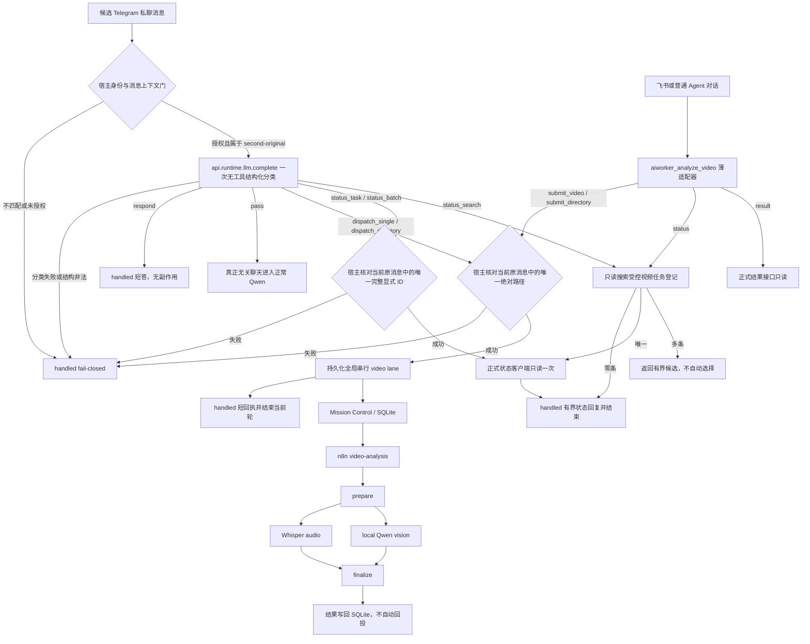

# OpenClaw 视频调度与分析主流程

## 文档状态

本文描述当前生产视频任务链契约。生产事实仍以对应提交、远端实际运行仓库和验收
记录为准；本文不替代真实 Telegram 网络入站证据。

## 核心结论

项目只维护 `aiworker-task-flow` 一条当前视频任务链。原生 `before_dispatch` 和
`aiworker_analyze_video` 是面向不同会话入口的薄适配器，不是两套链路；它们必须
复用同一 runner、持久串行队列、状态权威规则和正式结果接口。

Telegram 私聊由 `before_dispatch` handler 通过宿主 `api.runtime.llm.complete`
调用 Qwen 一次，完成无工具、严格结构化的语义分类；模型只表达意图判断，不拥有
鉴权、路径、任务身份或副作用权限。进入正常 Agent 对话的飞书等请求使用结构化
`aiworker_analyze_video`，但不能拥有另一套提交、状态或结果实现。

宿主随后从当前原始消息中独立校验授权 Telegram 私聊、会话与发送者一致性、
唯一绝对文件/目录路径、唯一完整 taskId/batchId，或当前消息复制的标题/关键词。单视频与目录批次都进入同一个
持久化全局串行 video lane。派发成功后 handler 返回 handled 短回执并结束；同轮
不读状态、不轮询、不重试、不重提、不等待，也不在完成后回投 Telegram。

## 单链路与单版本约束

入口适配器不得复制任务提交、状态轮询、终态判断、结果选择或错误降级逻辑。公共
行为放入 `aiworker-task-flow/lib` 的共享模块，控制台只复用该契约并生成安全投影。
功能升级直接迁移当前实现和全部调用方，不保留长期并行的旧版链路、版本开关、
双写或双读。生产旧 release 和备份只用于回滚，不继续接收功能修复。

## 语义分类与确定性门禁

内部分类器只允许十类动作：

| 动作 | 语义 | 宿主必须再次确认的证据 |
|---|---|---|
| `dispatch_single` | 现在分析一个视频文件 | 当前原消息中唯一、规范、受支持的绝对本地视频路径 |
| `dispatch_directory` | 现在分析一个视频目录 | 当前原消息中唯一、规范的绝对本地目录路径及明确目录意图 |
| `status_task` | 查询一个任务 | 当前原消息中唯一完整 taskId，且不存在 batchId |
| `status_batch` | 查询一个批次 | 当前原消息中唯一完整 batchId，且不存在 taskId |
| `status_search` | 按标题/关键词查询 | 当前原消息中复制的非空、有界搜索词；仅在已授权单发送者入口搜索受控视频任务登记 |
| `result_task` | 按任务编号读取正式结果 | 当前原消息中唯一完整 taskId，且明确要求完整或详细结果 |
| `result_batch` | 按批次编号读取正式结果 | 当前原消息中唯一完整 batchId，且明确要求完整或详细结果 |
| `result_search` | 按标题/关键词读取正式结果 | 当前原消息中复制的最小明确标题、文件名、季集号或关键词 |
| `respond` | 视频相关但不执行或证据不足 | 无 runner 副作用 |
| `pass` | 真正无关的普通聊天 | 才允许进入正常 `second-original` |

分类器必须输出单一结构化结果，不得使用工具、访问文件、猜测、补全、改写或
正规化值。宿主只接受分类值与当前原始消息证据逐字一致的结果。负向、条件、
举例、方法咨询、多个候选、缺少路径或 ID、相对路径、URL、非规范路径和部分 ID
均不能触发 runner。

当前边界不使用纯正则状态入口或内存 recent receipt。状态与结果可由当前消息显式
携带完整 taskId/batchId，或由当前消息中的标题/关键词查询。后者只搜索受控任务登记
字段并调用正式平台接口；它不是跨用户或任意文件搜索，不读取提示词、源路径、
n8n execution、媒体、进程或聊天历史，也不回显源路径或提示词。

## 鉴权与失败关闭

OpenClaw 先完成 Telegram DM 上游准入，插件再核对：

1. channel 和 private-message 形状；
2. 唯一 `second-original` session；
3. event/context 的会话与发送者一致性；
4. 域隔离 sender hash；
5. 有效消息时间；
6. 当前原消息内与分类结果一致的唯一证据。

classifier 超时、JSON/schema 错误、身份不一致、未授权、证据偏差、输入非法或
runner 异常都由 handler 自行 catch，并返回 handled 的失败关闭短答。不得让这些
消息落入正常 Qwen、generic task、`exec`、文件搜索、直接 ffmpeg/Whisper/Qwen
或旧视频学习链。仅 `pass` 可以放行。

## 持久化全局串行 video lane

单视频不再绕开批次控制器直接提交：它作为一个 item 的持久任务进入全局 lane；
目录则形成确定性、非递归、排序后的多 item 任务。所有任务共享进程级全局锁，
因此无论来自多少条消息，任一时刻最多只有一个视频进入正式下游。

持久状态保存稳定 task/batch 身份、不可变请求指纹和 item 终态；写入使用原子
替换，执行前检查源文件漂移，幂等复投返回原状态，worker 重启后可继续排队任务
且跳过终态 item。平台暂时不可用时暂停并等待以后续跑，不另造 ID。状态摘要只
暴露计数、当前项和失败项等有界信息，不泄露原始路径。

## 派发与状态契约

合法单视频 runner 固定使用同值 taskId/idempotency key、`delivery=none`、
`wait-seconds=0` 和禁止隐藏恢复查询的提交方式；目录 runner 使用稳定 batchId、
`delivery=none`。两者只负责创建或复用持久队列状态并唤醒全局 worker。

派发后立即返回含稳定 taskId 或 batchId 的短回执并结束。当前轮禁止状态读取、
Mission Control/n8n 检查、等待、轮询、重试、重提、进度播报和完成回投。

以后新的状态消息可携带完整显式 ID，或携带标题/关键词：taskId 调正式 task
status 一次，batchId 调正式 batch status 一次；标题搜索唯一命中后以有界摘要状态
接口调对应正式状态一次，多个命中仅返回候选。平台存在该任务记录时，平台状态
始终覆盖耐久本地登记；只有平台无记录或暂时不可用时才允许本地降级。平台终态
不得继续进入待执行队列。查询不扫描任意文件，不轮询、不重试、不提交、不恢复。
只有正式 task 状态 `succeeded` 可表述为
完成；批次只报告正式接口返回的有界状态和计数。

## 下游无状态边界

正式下游固定为：

`全局 video lane -> Mission Control / SQLite -> n8n -> prepare -> Whisper audio + local Qwen3.8 vision -> chapter checkpoints -> bounded final synthesis -> finalize -> SQLite`

`prepare` 负责受控收件、校验、分段和阶段元数据；Whisper 处理语音，本地 Qwen3.8
视觉服务处理画面；`finalize` 先合并音画时间线，再按章节 checkpoint 做有界文本
汇总。视觉服务和汇总均使用 `memoryMode=none`，视频任务使用 `delivery=none`。
Qwen 的 `<think>` 私有推理不会进入 checkpoint 或下一次汇总提示；SQLite 是任务与
审计状态，不是智能体长期记忆。章节或最终汇总失败时，重试同一 task ID 只从已有
checkpoint 继续，不重跑已成功阶段。

## 验收口径

候选进入发布流程前至少需要证明：

1. classifier 对候选消息仅调用一次宿主 `api.runtime.llm.complete`，无工具，输出
   严格结构化；
2. 模型分类不能绕过 Telegram 私聊、sender、原消息证据与完整 ID 校验；
3. 单视频与目录任务共享持久化全局锁，跨任务也不会并行执行视频；
4. 派发只产生一次入队及一个短回执，同轮状态读取、重试、重提和回投均为零；
5. status_task/status_batch 只接受当前消息中的显式完整 ID，各只读一次；status_search
   仅搜索受控任务登记，唯一命中才额外读取一次正式状态，多命中不选择；result 查询遵守
   相同隔离并在同名候选中提供任务编号、批次信息和完成时间；
6. classifier/校验/runner 失败均 handled fail-closed，只有无关 `pass` 进入 Qwen；
7. 下游 `prepare/audio/vision/finalize` 可追踪，所有模型节点均为
   `memoryMode=none`，视频 `delivery=none`；
8. 本地测试、installed synthetic 和真实 Telegram 生产验收必须分开陈述。

本文档本身和本地测试都不证明生产已经采用该契约。
