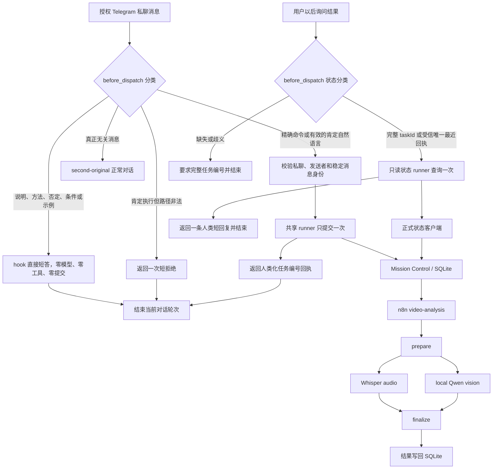

# OpenClaw 视频分析主流程

## 文档状态

本文描述本地 `0.4.1` 候选架构，不代表 GitHub main 或生产环境已经完成
升级。生产事实必须以单独的提交、部署和验收证据为准。

## 一条业务主线

授权 Telegram 私聊中的单视频请求只有一个会话入口：
`aiworker-video-command` 原生插件的 `before_dispatch`。它同时识别精确命令
和肯定自然语言，不再让千问选择视频执行工具，也不依赖模型运行期的工具状态机。
Telegram 群聊和其他渠道不在这个执行入口的承诺范围内，插件不接管其中的说明类
对话，也不会在其中提交视频任务。



## 请求分类

下表只描述已通过上游准入和插件 sender gate 的 Telegram 私聊：

| 当前消息 | 入口决定 | 对话结果 |
|---|---|---|
| `分析视频 /绝对路径/video.mp4` | 插件直接提交 | 短受理回执 |
| `帮我分析一下这个视频 /绝对路径/video.mp4` | 插件直接提交 | 短受理回执 |
| `只分析/仅分析这个视频 /绝对路径/video.mp4` | `只/仅` 不视为否定，插件直接提交完整音画链 | 短受理回执 |
| `只分析画面/仅分析音频 /绝对路径/video.mp4` | 当前入口不支持局部模态 | 一次短拒绝 |
| “怎么分析”“先给方案”“能识别什么” | hook 直接处理 | 固定短答，零模型、零工具、零提交 |
| “不要执行”“如果可以再分析” | hook 直接处理 | 固定确认，零模型、零工具、零提交 |
| 肯定执行但缺路径、多路径、相对路径、URL 或格式不支持 | 插件失败关闭 | 一次短拒绝 |
| “查进度”“查一下刚才的视频”或带完整任务编号的状态请求 | 插件直接只读查询一次 | 一条短状态回复，零模型、零工具搜索 |
| 状态请求缺少受信最近任务号，或最近回执有歧义 | 插件失败关闭 | 只要求完整任务编号 |
| 与视频分析无关 | 不接管 | 原有会话逻辑 |

有效单视频路径必须是生产 Mac 上唯一的绝对本地路径，扩展名为 `.mp4`、
`.mov`、`.mkv`、`.webm` 或 `.m4v`。路径含空格时使用一对匹配引号；插件
不猜路径、不搜索文件、不下载附件，也不展开变量或 shell 表达式。
精确命令在路径后不能追加口语修饰；“不要等待”“不要回投”等偏好应使用肯定
自然语言表达，插件仍会一次派发并立即结束当前轮次。

## 模块职责

| 模块 | 唯一职责 |
|---|---|
| 请求分类器 | 区分提交、正常对话、短拒绝和无关消息 |
| 身份模块 | 复用上游 Telegram DM 准入，校验私聊与一致的会话/发送者身份，派生稳定任务键 |
| `before_dispatch` | 编排提交、说明与后续状态分类；决定是否在模型前结束当前消息 |
| 提交 runner | 固定参数调用已安装客户端一次，并验证短回执 |
| 状态 runner | 只读查询一个已解析 task ID 一次，并将正式状态映射为短回复 |
| `aiworker-task-flow` | 受控收件、幂等提交、状态与批次查询 |
| Mission Control / SQLite | 持久化父任务、阶段任务、状态和最终结果 |
| n8n | 编排 `prepare -> audio + vision -> finalize` |
| Whisper / local Qwen | 分别处理音频和画面，不接收 OpenClaw 会话记忆 |
| `second-original` | 在目标私聊中只处理插件判定为真正无关的普通聊天；不参与视频提交决策 |

这种拆分把“理解聊天”和“产生视频任务副作用”分开。插件不直接处理媒体、
不扫描原始分析结果，只消费正式状态客户端返回的安全限长摘要；n8n 不直接向
Telegram 回投；千问不构造任务身份或 shell 命令。
在目标私聊中，视频形状的说明、能力、否定、条件和示例消息也不得调用
`memory_search`、`exec`、generic task 或文件搜索。以后用户明确查询已有任务
状态时，仍由 `before_dispatch` 在模型前接管：插件只使用当前消息中的完整任务号，
或该私聊受信且唯一的最近回执绑定；随后调用受限状态 runner 一次。状态查询不
启动千问，也不进入 OpenClaw 工具选择。

## 提交契约

插件和 runner 内部固定映射为一次受控调用：

```text
--video-file <validated-path>
--task-id <stable-message-key>
--idempotency-key <same-stable-message-key>
--delivery none
--wait-seconds 0
--no-trigger-recovery
```

新任务只返回：

```text
已提交，任务编号：<taskId>。结果请稍后查询。
```

幂等命中已有任务只返回：

```text
任务已存在，任务编号：<taskId>。结果请稍后查询。
```

`status` 和 `duplicate` 继续用于内部校验与审计，不向普通用户展示。

`--no-trigger-recovery` 关闭客户端在触发错误后的隐藏状态读取；有歧义时保留
受控媒体和同一个稳定任务号，交给以后用户明确发起的查询处理。

之后立即结束当前轮次。同轮不查询状态、不看 n8n、不等待、不重试、不重提，
也不连续播报后台进度。

## 后续状态查询契约

用户以后说“查进度”“查一下刚才的视频”或提供完整任务编号时，同一个
`before_dispatch` 先完成私聊身份校验，再按下面的固定顺序处理：

1. 优先接受当前消息中完整的任务编号；否则只使用插件保存的该私聊受信且唯一
   的最近回执绑定。
2. 没有可信最近编号、编号不完整或多条回执造成歧义时，只回复
   `请提供完整任务编号。`，不启动查询。
3. 已解析唯一编号时，只调用一次正式只读状态 runner。runner 等价使用
   `submit-task.mjs --status <task-id>`，但不由千问构造或执行。
4. 将一次返回映射为 `任务已受理，正在等待处理。`、`任务正在处理中。`、
   `任务已完成。`、`任务处理失败。` 或 `暂时无法查询任务状态。`，然后结束。
   只有 `succeeded` 能写成已完成；成功或失败只可追加正式状态接口已经返回的
   安全限长摘要或原因。普通状态短答不重复冗长任务编号。

整个状态轮次禁止启动 Qwen、模型选工具、`memory_search`、`exec`、进程管理、
文件搜索、直接扫描 Mission Control/SQLite、查看 n8n、轮询、重试、重提或转入
generic task。查询异常只能报告同一任务暂时无法查询，不得建议重新提交。

OpenClaw 在 hook 前完成 Telegram DM allowlist/pairing 准入。插件配置另外只保存
当前唯一 Telegram command owner 的域隔离 SHA-256，不保存原始发送者 ID；
`before_dispatch` 校验私聊、session/sender 一致性后，还必须让当前 sender 的哈希
精确命中该配置，才会进入 runner。hook 虽没有 `senderIsOwner` 字段，但这个二次
发送者门可阻止以后新增 paired 用户自动获得视频派发权。扩展为多人派发必须显式
调整 sender 策略并重新审计，不能仅增加 pairing。

## 下游无状态边界

正式下游链固定为：

`Mission Control / SQLite -> n8n -> prepare -> Whisper audio + local Qwen vision -> finalize -> SQLite`

`prepare` 负责受控收件、校验、分段和阶段元数据；Whisper 处理语音，本地
Qwen 处理画面；`finalize` 合并音频、视觉和时间线证据。所有模型工作节点
使用 `memoryMode=none`，视频任务使用 `delivery=none`。检查点用于恢复同一
任务，不用于创建替代任务。

## 失败关闭

原生插件是目标 Telegram 私聊中单视频自然语言执行的唯一入口。如果插件缺失、
未加载或未接管有效执行请求，`second-original` 不得退化到 generic task、`exec`、直接
`submit-task.mjs`、文件搜索、ffmpeg、Whisper、Qwen 或旧学习链。此时只返回：

```text
未提交：视频入口当前不可用。
```

旧 `VL`、`video-learning-pipeline`、`DIRECTOR_BRAIN`、导演脑提取和直接
全视频处理均不属于本流程。

## 验收口径

候选发布前至少证明：

1. 精确命令和肯定自然语言分别触发同一个 `before_dispatch` runner，且各只
   提交一次；
2. 插件已加载时，目标 Telegram 私聊中的说明、方法、否定、条件和示例消息由
   同一个 hook 直接给出固定短答，模型与工具均不运行，Mission Control 与 n8n
   均零增量；群聊与其他渠道不计入这项结构性保证；
3. 非法执行输入只返回短拒绝，零提交；
4. 部署门必须证明插件随 Gateway 启动并保持 `before_dispatch` 已加载；skill 与
   workspace 规则同时禁止插件缺失时退化到 generic、`exec` 或媒体旁路；
5. 成功任务只有一个父任务和确定性阶段，n8n 只有一次 video-analysis 执行；
6. `prepare/audio/vision/finalize` 可追踪，全部 `memoryMode=none`，视频
   `delivery=none`；
7. 当前轮次零状态查询；后续状态消息由 `before_dispatch` 在模型前接管，只读
   查询原任务一次，零 Qwen、零工具搜索、零轮询且不产生新提交；
8. 数据库 `quick_check`、服务健康、媒体收件箱和临时残留门禁全部通过。

端口在线、插件出现在清单、千问能聊天或本地单元测试通过，都不能单独当作
生产链路验收。
