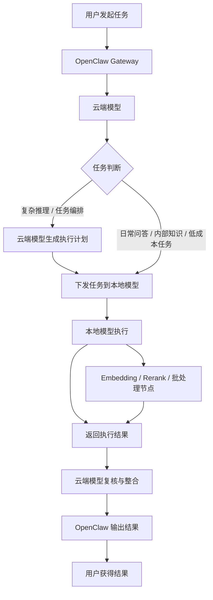

# OpenClaw 工作流程图

## 云端模型指挥本地模型

```mermaid
flowchart TD
    A[用户发起任务] --> B[OpenClaw Gateway]
    B --> C[云端模型]
    C --> D{任务判断}

    D -->|复杂推理 / 任务编排| E[云端模型生成执行计划]
    E --> F[下发任务到本地模型]

    D -->|日常问答 / 内部知识 / 低成本任务| F

    F --> G[本地模型执行]
    G --> H[返回执行结果]
    H --> I[云端模型复核与整合]
    I --> J[OpenClaw 输出结果]
    J --> K[用户获得结果]

    G --> L[Embedding / Rerank / 批处理节点]
    L --> H
```

## 简化理解

- 云端模型负责决策、编排、复核
- 本地模型负责执行、计算、低成本任务
- 备用节点负责 embedding、rerank、批处理
