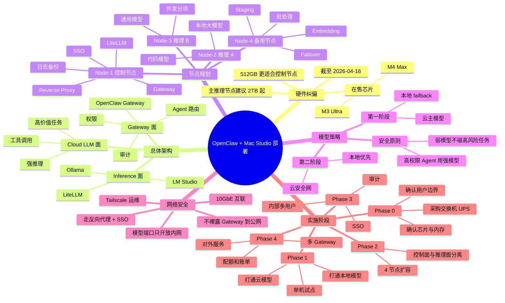

# OpenClaw + Mac Studio 混合部署规划

更新日期：2026-04-16

## 目标

你要做的不是“装一个 OpenClaw”这么简单，而是搭一套可扩展的 AI 员工基础设施，至少包含 3 层：

1. OpenClaw Gateway / Agent 层
2. 本地模型推理层
3. 云端大模型层

并且这套东西后面要能扩到 4 台 Mac Studio，供别人一起使用。

## 先纠正一个关键硬件点

截至 2026-04-16，Apple 官网在售的 Mac Studio 芯片是 `M4 Max` 和 `M3 Ultra`，不是笼统的“Mac Studio M3”。

- 当前产品线里确实有 `512GB SSD` 配置，但它对应的是整条产品线的基础存储位。
- Apple 当前规格页同时列出了：
  - `M4 Max` 基础内存 `36GB`，基础存储 `512GB`
  - `M3 Ultra` 基础内存 `96GB`，基础存储 `1TB`

所以你现在必须先确认第一台机器到底是哪一种：

- 如果你说的是 `512GB` 那台，大概率是 `M4 Max`
- 如果你真正想买的是 `M3` 档位，那应该是 `M3 Ultra`，而不是 `512GB` 基础盘配置

我的判断：

- 如果第一台已经买了 `512GB` 机器，就把它定义成“控制平面 / Gateway / 管理节点”
- 不要把 `512GB` 机器当成长期主力本地推理节点

这是工程判断，不是 Apple 官方原话。原因很简单：本地模型、镜像、日志、缓存、浏览器 profile、回放数据、监控数据会很快把 512GB 挤满。

## 核心架构结论

### 1. OpenClaw 不适合直接做“一个共享网关服务所有不可信用户”的架构

OpenClaw 官方安全文档写得很明确：它默认是“单一可信操作者边界”的个人助理模型，不是一个适合多个对抗性用户共用同一个 Gateway 的敌对多租户安全边界。

这意味着：

- 如果是你自己或一个高度互信的小团队，可以共用一个 Gateway
- 如果未来是“多人共用、彼此不完全互信、甚至对外客户使用”，就应该拆成多个 trust boundary
- 最稳妥的做法是“按团队 / 租户 / 业务线拆 Gateway”，而不是“所有人共用一个超级 Gateway”

### 2. 你的目标架构应该是“Gateway 池 + 推理池 + 云兜底”

我建议你把系统拆成下面这三个面：

- `Gateway 面`
  - OpenClaw 自身
  - Agent 配置
  - 权限、审计、路由
  - 外部接入
- `Inference 面`
  - LM Studio / llmster
  - Ollama
  - 可选 LiteLLM 统一路由
- `Cloud LLM 面`
  - 负责强推理、工具调用、复杂任务、处理不可信内容

### 3. 不建议第一阶段就上 Kubernetes

这是我的工程建议：

- 4 台 Mac Studio 的第一版，更适合用 `launchd + SSH + Tailscale + 反向代理 + 配置管理`
- 不建议一开始就在 macOS 上堆 `k3s/Kubernetes`

原因：

- OpenClaw 在 macOS 上有明显的 TCC 权限、桌面会话、浏览器、自动化依赖
- 本地模型服务也未必都适合先容器化
- 你的第一目标是稳定跑起来，而不是先做平台工程表演

等你验证并发、用户数、账单、租户隔离模型之后，再决定是否要把一部分控制面迁到 Linux/K8s。

## 我建议的 4 台机器角色划分

### 方案 A：你第一台已经是 512GB 机器

把第一台定义成：

- `Node-1: Control / Gateway / Bastion`

后续 3 台再按“主推理节点”买。

推荐分工：

### Node-1: 控制平面与接入节点

职责：

- OpenClaw Gateway 主实例
- Web / Control UI 接入
- 反向代理
- 身份认证
- 审计与日志汇总
- 可选 LiteLLM 统一路由
- 可选 QMD 本地记忆检索 sidecar
- 备份、发布、运维脚本

建议规格：

- 如果你已经买了 `M4 Max + 512GB SSD`，可以先用
- 更稳妥的长期规格是 `64GB-128GB unified memory + 1TB SSD`

定位：

- 这是“控制节点”
- 不是“主推理节点”

### Node-2: 本地推理主节点 A

职责：

- 本地代码模型
- 本地通用模型
- 中高并发任务

建议规格：

- `M3 Ultra`
- `256GB unified memory` 优先
- `2TB SSD` 起步，`4TB` 更从容

### Node-3: 本地推理主节点 B

职责：

- 作为第二个主力推理池
- 跑另一组模型族
- 分担并发
- 做滚动升级时的替代节点

建议规格：

- `M3 Ultra`
- `256GB unified memory`
- `2TB SSD` 起步

### Node-4: 备用 / 批处理 / Embedding / 预发布节点

职责：

- Embedding / rerank / 检索任务
- 批量离线任务
- 灰度发布
- 作为备用 Gateway 或备用模型节点

建议规格：

- 如果预算够，继续 `M3 Ultra + 256GB + 2TB`
- 如果预算要控，可以退一步做 `M4 Max + 128GB + 2TB`

## 为什么不建议 4 台都买成同一配置

因为你的工作负载不是单一类型：

- OpenClaw Gateway 主要吃的是稳定性、权限、浏览器/自动化环境、网络接入和日志管理
- 本地模型推理主要吃的是统一内存、磁盘、并发和散热

所以更合理的是：

- `1 台控制节点`
- `2 台主推理节点`
- `1 台备用 / 批处理 / 预发布节点`

而不是 4 台全都做“平均主义”。

## 本地模型与云模型的分层建议

### 云模型负责什么

云模型建议负责：

- 工具调用很多的 Agent
- 复杂推理
- 读外部网页、邮件、文档等不可信内容
- 高价值任务
- 对稳定性要求最高的任务

原因是 OpenClaw 官方安全文档明确建议：凡是能跑工具、接触不可信输入的 Agent，优先使用“最新一代、最高级别”的强模型，而不是小模型。

### 本地模型负责什么

本地模型建议负责：

- 成本敏感的常规问答
- 内部知识库问答
- 代码补全 / 批处理
- Embedding / rerank
- 隐私敏感、但对极限推理要求没那么高的任务

### 推荐的模型策略

第一阶段不要做“纯本地 All-in”。

建议直接采用：

- `云主模型 + 本地 fallback`

稳定后再评估是否改成：

- `本地优先 + 云安全网`

OpenClaw 官方本地模型文档也明确推荐保留 hosted fallback，并使用 `models.mode: "merge"`。

## 本地模型栈怎么选

### 首选：LM Studio / llmster

这是目前最适合 Apple Silicon 的第一选择之一，原因是 OpenClaw 官方文档明确写了：

- LM Studio 可以跑 `GGUF` 或 `MLX`
- 提供本地 OpenAI 风格接口
- OpenClaw 直接支持 `lmstudio` provider

适合用在：

- Mac Studio 主推理节点
- 需要较好 Apple Silicon 适配的模型服务

### 辅助：Ollama

Ollama 适合：

- 快速拉模型
- 跑 embedding
- 做一些轻量通用模型
- 在早期快速试错

### 二阶段再考虑：LiteLLM

当你开始“供别人使用”时，我建议再把 LiteLLM 放到 Node-1 上，作为统一模型路由层：

- 统一 API 入口
- 统一配额
- 统一日志
- 统一故障切换
- 云模型和本地模型统一编排

这样 OpenClaw 就不用直接跟所有 provider 拆散对接。

## OpenClaw 在 macOS 上的一个隐藏关键点

如果你的 AI 员工未来会做这些动作：

- 浏览器操作
- AppleScript
- 屏幕理解
- 麦克风 / 语音
- 系统自动化

那至少有 1 台 Gateway 节点必须是“有桌面会话、有 TCC 权限、已经完成授权”的 macOS 机器。

OpenClaw 的 macOS onboarding 会申请这些权限：

- Automation
- Notifications
- Accessibility
- Screen Recording
- Microphone
- Speech Recognition
- Camera
- Location

所以：

- `推理节点` 可以尽量无头化
- `Gateway / Operator 节点` 不要设计成完全无桌面、无登录会话的纯服务器思路

## 网络与安全拓扑建议

### 第一原则

不要把 OpenClaw Gateway 原生端口直接裸露在公网。

官方文档说明：

- Gateway 默认端口是 `18789`
- 同一个端口复用 WebSocket 和 HTTP
- 这个 HTTP 面上还挂着 Control UI 和 canvas host

所以建议：

- Gateway 只监听 `loopback` 或内网地址
- 对外统一走 `Caddy / Nginx / Traefik + OAuth/SSO`
- 多机接入时使用 `token` 或受控的 `trusted-proxy` 模式
- 本地模型服务端口只开放给内网，不要直连公网

### 推荐网络结构

- 一台 `10GbE` 交换机
- 4 台 Mac Studio 全部走有线 `10GbE`
- 单独一个管理网段或至少固定 DHCP / 静态 IP
- 使用 `Tailscale` 做远程运维
- 外部访问通过 `SSO + 反向代理`
- 模型节点只允许来自 Gateway / LiteLLM 的访问

### 不同使用场景的安全建议

如果是：

- `你自己用`
  - 1 个 Gateway 就够
- `内部 3-20 人小团队`
  - 可先 1 个 Gateway，但要强认证、最小工具权限、审计
- `跨团队或对外服务`
  - 建议拆多个 Gateway
  - 按组织 / 项目 / 客户做 trust boundary

## 推荐实施路线

## Phase 0: 采购与设计确认

先做这 6 件事：

1. 确认第一台机器到底是 `M4 Max` 还是 `M3 Ultra`
2. 确认第一台机器统一内存大小
3. 明确“供他人使用”是内部团队，还是外部客户
4. 采购 `10GbE` 交换机、UPS、外置备份盘或 NAS
5. 决定统一身份认证方案
6. 决定云模型 provider

我的采购建议：

- 如果第一台已买 `512GB`，保留它做 Node-1
- 后续新增 2 台主推理节点时，不要再买 512GB
- 主推理节点直接上 `2TB` 或更高

## Phase 1: 单机试点

目标：

- 先把 OpenClaw 跑起来
- 打通 1 个云模型
- 打通 1 个本地模型
- 验证你的 AI 员工工作流

建议动作：

1. 在 Node-1 安装 OpenClaw CLI / macOS app
2. 完成 onboarding
3. 开通 Gateway service
4. 接入 1 个强云模型 provider
5. 安装 LM Studio 或 Ollama
6. 跑通本地模型 provider
7. 用 `models.mode: "merge"` 做混合配置
8. 建立 3 个 Agent 配置

建议先建这 3 类 Agent：

- `admin-agent`
- `ops-agent`
- `worker-agent`

这样你后面扩机器时不会所有能力都堆在一个 agent 上。

## Phase 2: 扩成 4 节点

目标：

- 把 OpenClaw 控制面和模型推理面拆开
- 开始做并发和容灾

建议动作：

1. Node-1 只保留 Gateway、路由、认证、日志、LiteLLM
2. Node-2 部署 LM Studio / llmster 主模型 A
3. Node-3 部署 LM Studio / llmster 主模型 B
4. Node-4 部署 embedding、rerank、批任务和备用模型
5. 所有模型端口只开放到内网
6. Gateway 对接统一路由层，不直接到处打散
7. 建立基础监控和容量看板

## Phase 3: 内部多用户开放

目标：

- 开始让别人用
- 但不要直接走“公网多租户 SaaS”模式

建议动作：

1. 先只给内部可信用户开放
2. 强制 SSO / 统一登录
3. 所有 agent 默认最小权限
4. 不同业务线拆不同 agent / workspace
5. 做日志留痕
6. 做 token 轮换
7. 定期跑 `openclaw security audit`

## Phase 4: 真正对外服务

只有在你验证了下面这几件事之后，再进入这一步：

- 成本模型清楚
- 负载模型清楚
- 故障恢复流程清楚
- 租户边界清楚
- 审计要求清楚

到这时我才建议你考虑：

- 多 Gateway 池
- 更强的 IAM
- 独立租户工作区
- 配额、账单、限流
- 更细的日志和审计
- 是否需要把一部分服务迁到 Linux / 容器平台

## 最小可行配置建议

### 如果你现在只有 1 台 512GB 机器

可行的最小配置是：

- 这台机器跑 OpenClaw Gateway
- 同机先跑一个轻量本地模型做试验
- 正式任务主要走云模型
- 等 M3 Ultra 节点到位后，再把重推理迁出去

这是最稳的起步方式。

### 如果你马上就会补 3 台机器

更推荐：

- `Node-1`
  - OpenClaw Gateway
  - 反向代理
  - SSO
  - LiteLLM
  - 日志 / 备份 / QMD
- `Node-2`
  - 本地代码模型
- `Node-3`
  - 本地通用模型
- `Node-4`
  - embedding / rerank / 批处理 / 备用

## 一个可参考的 OpenClaw 混合配置思路

下面是示意，不是直接可复制的最终生产配置：

```js
{
  agents: {
    defaults: {
      model: {
        primary: "openai/<strong-tool-model>",
        fallbacks: [
          "lmstudio/<local-large-model>",
          "openai/<backup-strong-model>"
        ]
      }
    }
  },
  models: {
    mode: "merge",
    providers: {
      lmstudio: {
        baseUrl: "http://node-2-or-node-3:1234/v1",
        apiKey: "${LM_API_TOKEN}",
        api: "openai-responses",
        models: [
          {
            id: "<local-large-model>",
            name: "Local Large Model",
            reasoning: false,
            input: ["text"],
            cost: { input: 0, output: 0, cacheRead: 0, cacheWrite: 0 },
            contextWindow: 128000,
            maxTokens: 8192
          }
        ]
      }
    }
  }
}
```

等到第二阶段，再把 `lmstudio` / `ollama` 的多个后端统一收口到 LiteLLM。

## 你现在最该避免的 8 个坑

1. 把 `512GB` 机器当成长期主推理节点
2. 一开始就做公网多租户共享 Gateway
3. 一开始就上 Kubernetes
4. 本地模型和 Gateway 全暴露到公网
5. 不做 SSO / token 管理
6. 不区分控制面和推理面
7. 用弱小模型跑高权限 Agent
8. 忽略 macOS TCC、桌面会话和浏览器权限问题

## 我给你的最终建议

### 最稳的落地路线

- 第 1 步：把现有 `512GB` 机器当成 Node-1 控制节点
- 第 2 步：先做“云主模型 + 本地 fallback”
- 第 3 步：后续 2 台买成 `M3 Ultra + 256GB + 2TB` 级别的主推理节点
- 第 4 步：第 4 台做备用 / embedding / staging
- 第 5 步：供别人使用时，先内部开放，再拆 trust boundary

### 一句话判断

如果你的目标是“AI 员工自己跑任务 + 以后多人一起用”，那第一优先级不是“买 4 台一样的机器”，而是：

- 先把 `控制面`
- `本地推理面`
- `云模型兜底`
- `安全边界`

这四件事拆干净。

## 脑图



## 参考资料

- Apple Mac Studio 规格页
  - https://www.apple.com/mac-studio/specs/
- OpenClaw 本地模型
  - https://docs.openclaw.ai/gateway/local-models
- OpenClaw 安全
  - https://docs.openclaw.ai/gateway/security
- OpenClaw macOS onboarding
  - https://docs.openclaw.ai/start/onboarding
- OpenClaw 多 Gateway
  - https://docs.openclaw.ai/gateway/multiple-gateways
- OpenClaw Provider Directory
  - https://docs.openclaw.ai/providers
- OpenClaw LM Studio provider
  - https://docs.openclaw.ai/providers/lmstudio
