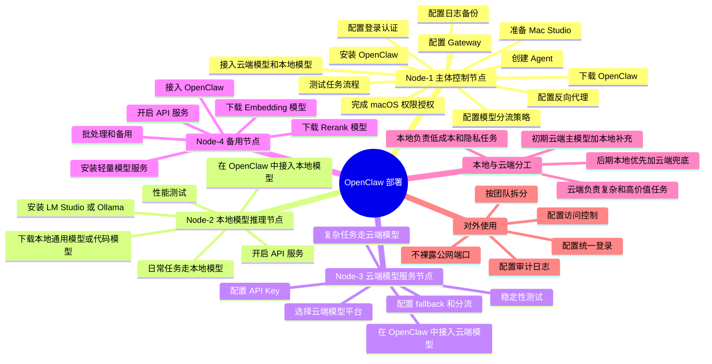

# OpenClaw + Mac Studio 思维导图

```mermaid
mindmap
  root((OpenClaw 部署))
    Node-1 主体控制节点
      准备 Mac Studio
      下载 OpenClaw
      安装 OpenClaw
      完成 macOS 权限授权
      配置 Gateway
      接入云端模型和本地模型
      配置模型分流策略
      创建 Agent
      测试任务流程
      配置反向代理
      配置登录认证
      配置日志备份
    Node-2 本地模型推理节点
      安装 LM Studio 或 Ollama
      下载本地通用模型或代码模型
      开启 API 服务
      在 OpenClaw 中接入本地模型
      日常任务走本地模型
      性能测试
    Node-3 云端模型服务节点
      选择云端模型平台
      配置 API Key
      在 OpenClaw 中接入云端模型
      复杂任务走云端模型
      配置 fallback 和分流
      稳定性测试
    Node-4 备用节点
      安装轻量模型服务
      下载 Embedding 模型
      下载 Rerank 模型
      开启 API 服务
      接入 OpenClaw
      批处理和备用
    本地与云端分工
      本地负责低成本和隐私任务
      云端负责复杂和高价值任务
      初期云端主模型加本地补充
      后期本地优先加云端兜底
    对外使用
      不裸露公网端口
      配置统一登录
      配置访问控制
      配置审计日志
      按团队拆分
```
