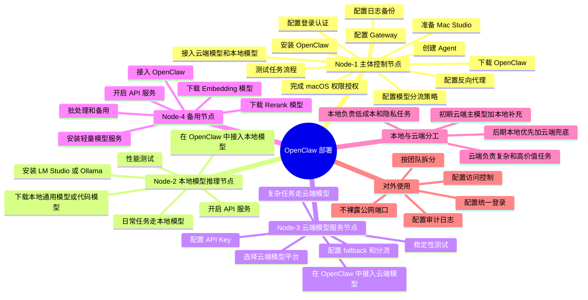

# OpenClaw + Mac Studio 关键步骤版

适合场景：

- 先 1 台机器跑起来
- 后续扩到 4 台
- 本地模型 + 云端大模型混合
- 后面给别人使用

## 按节点归类的关键步骤

### Node-1 主体控制节点

1. 准备 Mac Studio
2. 下载并安装 OpenClaw
3. 完成 macOS 权限授权
4. 配置 OpenClaw Gateway
5. 接入云端模型和本地模型
6. 配置模型分流策略
7. 创建基础 Agent
8. 测试任务流程
9. 配置反向代理和登录认证
10. 配置日志和备份

### Node-2 本地模型推理节点

1. 安装 LM Studio 或 Ollama
2. 下载本地通用模型或代码模型
3. 开启本地 API 服务
4. 在 OpenClaw 中接入本地模型
5. 让日常问答、内部知识、低成本任务走本地模型
6. 做性能测试

### Node-3 云端模型服务节点

1. 选择云端大模型平台
2. 配置 API Key 和额度控制
3. 在 OpenClaw 中接入云端模型
4. 让复杂推理、工具调用、高价值任务走云端模型
5. 配置 fallback 和分流策略
6. 做稳定性测试

### Node-4 备用 / Embedding 节点

1. 安装轻量模型服务
2. 下载 embedding / rerank 模型
3. 开启 API 服务
4. 接入 OpenClaw
5. 用作批处理 / 备用节点

## 本地与云端分工建议

- 本地模型：负责日常问答、内部知识库、隐私内容、低成本高频任务
- 云端模型：负责复杂推理、长上下文、联网工具调用、高价值任务
- 初期建议：`云端主模型 + 本地补充`
- 后期扩容：`本地优先 + 云端兜底`

### 对外提供使用前

1. 不要直接裸露 OpenClaw 端口到公网
2. 加统一登录
3. 加访问控制
4. 加审计日志
5. 按团队或租户拆分节点或网关

## 思维导图

## 最简落地顺序

1. 先把 Node-1 跑通
2. 再加 Node-2 本地模型
3. 再加 Node-3 云端模型
4. 最后加 Node-4 做备用和 embedding
5. 最后再开放给别人使用
