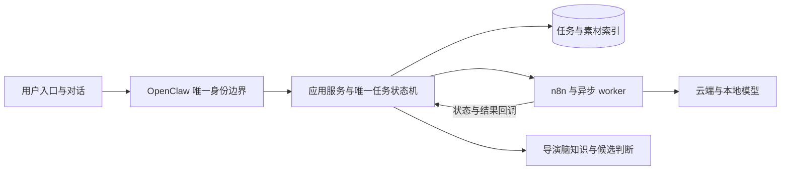

# 发布与长期维护演进

本方案保持现有用户功能、OpenClaw唯一鉴权和单一任务状态机。2026-09-06的首次蓝绿迁移尚未完成；下述后续阶段不代表已经在生产启用。

## 当前先完成的基础

首次迁移使用现有preinstall/bootstrap控制器及连续runner。保护按完成进度续期，单步保留超时和明确恢复入口。发布清单采用共享契约；安装、恢复、打包和来源验证必须使用一致的文件清单与限制。已完成阶段不得重放，不把修改旧证明或跳过实际数据操作当作提速。

当前架构继续采用模块化单体加异步worker：OpenClaw承担身份和薄入口，应用服务掌管业务与状态，n8n执行受管工作流，导演脑保存知识与候选判断。暂不拆分微服务或新增账号、队列、双写及另一套发布状态机。

权限统一沿OpenClaw边界，插件文件布局也遵循官方安装方式。项目侧的部署检查只验证来源、内容完整性、受管依赖和回滚证据；自有组件与官方安装组件通过各自明确的布局契约接入同一证据流程，避免复制一套更严格却不兼容的权限规则。

n8n 的端口监听、HTTP readiness 与完整工作流初始化是不同阶段。数据库 freeze 必须等待绑定本次进程的完整启动记录；进程重启后重新验证运行身份，不能修改已有 COMMITTED 证明。后续摘要解耦要把稳定的工作流内容与易变的进程身份分开，避免正常重启要求再次发布工作流。

图中执行链表示现有职责划分，不能据此启用仍被用户暂停的视频执行。蓝绿只替换应用运行版本，不创建第二条任务权威链。

## 优先改进顺序

| 阶段 | 改进 | 验收标准 |
| --- | --- | --- |
| 稳定基线 | 完成首次蓝绿迁移并记录应用、数据库schema、n8n、OpenClaw版本与回滚点 | 切换、健康、准入恢复和隔离对话证据真实齐备；原暂停视频lane保持原状态 |
| 影响说明 | CI输出各组件内容摘要及受影响测试分区 | 能解释每一步为何执行或复用；不因文档或其他组件变化误判业务改动 |
| 准备与激活分离 | n8n在线生成不可变候选，维护窗口仅执行必要的激活与迁移；应用使用统一安全收包入口 | 候选准备不改current、数据库或在线服务；激活使用原维护锁、备份和CAS；打包权限与成员审计自动完成 |
| 制品按内容复用 | 提交来源引用可复用组件制品，逐步解除整仓SHA对所有组件的强制重装 | n8n和插件内容未变时保留原物理制品；真实依赖变化会触发必要验证；attestation和回滚仍可追溯，不重标旧证明 |
| 日常蓝绿发布 | 正常应用更新只走候选验收、暂停新准入、路由切换、健康、恢复准入和旧槽排空 | 存量任务按release affinity完成；无需重新运行一次性的legacy冻结和bootstrap |
| 验证前移 | 在生产等价macOS隔离环境验证LaunchAgent、PID/FD、SQLite、socket及归档权限合同 | 生产仅复核当前身份、变更与切换结果；模拟测试不冒充真实系统合同证据 |

组件解耦必须同时设计来源证明、依赖摘要、兼容关系与回滚引用，不能仅去掉`SOURCE_COMMIT`相等检查。先以只读影响报告验证分类准确，再逐组件引入复用，避免一次改动重写整条发布链。

## 验证与执行效率

已通过且未受影响的验证直接复用，记录来源及适用范围。新增制品完整性、真实目标身份、改动功能和最终切换健康仍要核验。发现同类失败先统一根因，再运行有新增证据支持的定向验证；不逐错重建整个系统。

应用构建、独立制品传输和只读候选检查可并行；数据库写入、current选择、服务启停和路由切换由一个执行者串行管理。依赖与制品缓存按摘要校验后复用。耗时以阶段实际测量为准，不把固定等待当作成功证明。

两端 openrsync 的 `--copy-dest` 已用独立微型传输验证：相同文件可从远端旧制品复制，变化文件经 SSH 传输，目标保留字节、权限及相对链接且不与旧制品形成硬链接。正式使用必须落到全新隔离 staging，执行完整制品审核后才原子进入 `releases/<release-id>/standalone`；禁止对当前运行目录做增量覆盖。

298 制品已按该方式完成真实交付：增量传输 24.31 秒、20 个变化文件、网络发送 2,160,604 字节；完整 inventory 一致，无旧制品硬链接，成员审计没有禁入内容。该数字仅表示传输阶段，不能当成整次部署时间。后续分别记录准备、传输、维护、激活和验收耗时，并统计因同类合同错误导致的回滚次数，按实际瓶颈安排优化。

网络故障应在安装前识别，正在进行的安装和恢复不得重复依赖公网。当前 video installer 已把正式 preinstall apply/rollback 的远端来源复核收敛为本地已绑定来源与原共享 reservation gate；首次 dry-run 仍验证 GitHub。网络恢复后的续接须先区分 UNPREPARED 与已绑定或已结束的 attempt：只有原 transition 尚无安装 owner 和 bootstrap claim 时，才可用新控制目录沿用同一 COMMITTED n8n。不能把换目录当成绕过不可变 owner 的办法。后续准备与激活分离应让网络检查在维护前完成，并以明确的来源摘要交接。

完成部署后的纯文档审计提交只进入 GitHub，不触发构建、工作流导入或服务重启。当前发布工具仍有整仓 HEAD 绑定，生产 canonical 应保留已验证的部署 SHA，保留同版本恢复能力；记录中分别注明 GitHub 文档版本与实际运行版本。下一次正式发布再一次性快进到包含审计记录的真实代码候选，不为纯文档提交生成运行时。

未来多人使用继续沿OpenClaw的唯一身份边界扩展权限和资源配额。仅当监测证明单体资源隔离或扩容能力不足时，再评估独立执行节点；不预先引入分布式事务及额外运维系统。
