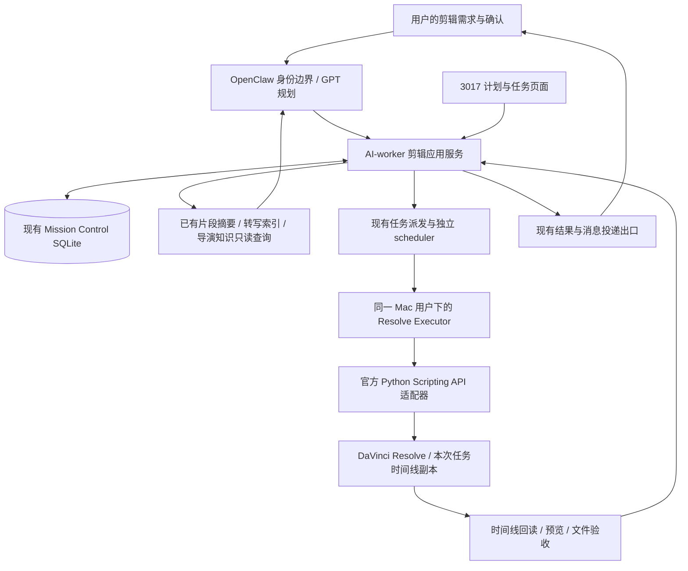

# GPT / OpenClaw 与 macOS Resolve 剪辑节点架构

设计日期：2026-09-19。状态：架构设计完成，开发和生产接入待实施。

## 1. 目标与本次边界

用户通过 OpenClaw 描述剪辑目标，GPT 从已有素材证据生成结构化剪辑计划，Video AutoWorker 校验并管理任务，Mac 上的独立执行进程调用 DaVinci Resolve。执行后回读时间线，生成预览，依据用户批准的交付范围导出成片。

本次交付为设计、开发拆分和验收标准。没有安装 MCP、修改 Resolve 设置、创建工程、剪辑、渲染或部署新能力。导演脑已有的默认只读、知识候选审核与执行隔离继续生效；设计完成不表示已开放剪辑权限。

第一阶段选择同机部署：远端 Mac Studio 同时运行 OpenClaw、AI-worker 和 Resolve，逻辑职责分离，进程独立。无需先购买另一台 Mac，也无需为同机通信增加远程节点配对。未来迁往另一台 Mac 时，沿用同一执行协议，单独验证传输和身份边界。

## 2. 当前依据

| 对象 | 本次依据 | 能得出的结论 |
| --- | --- | --- |
| 默认远端 Mac | 严格校验既有 SSH 主机身份，macOS 26.5.2 / arm64 | 可进行同机架构设计 |
| Resolve | 应用包版本 21.1.0，build 21.1.00017，发现运行进程 | 软件已安装且有进程，不代表 API 可用 |
| 官方开发文档 | 机器安装的 Scripting/README.md 和 DaVinciResolveScript.pyi | 存在 Python/Lua、时间线、素材池、渲染和稳定对象 ID 接口说明 |
| 外部脚本探测 | SSH 下仅调用 scriptapp('Resolve')，返回空 | 当前调用环境尚未接通；Studio 授权、Local 设置、解释器与桌面会话待核实 |
| gpt-main | 只读配置显示 18789、agent main、openai/gpt-6-astra | 是计划生成入口；未执行模型请求，也未证明剪辑工具已注册 |
| 当前任务系统 | n8n-task-runs、n8n-task-dispatch、n8n-task-queue、独立 scheduler | 已有任务、作用域、派发和执行租约，应扩展现有权威 |
| 当前证据系统 | video-segment-report、director-extraction-segments | 已有片段读取与分段 checkpoint；不能把摘要完整性等同于精确剪辑时间码 |
| RuntimeProvider | runtime/contracts.ts 只定义消息、会话和运行控制 | 属于模型/会话接口，不把 Resolve 假装成聊天 Provider |

上述为 2026-09-19 的有限只读检查，未读工程正文和用户聊天记录。实际 Studio 版本和 API 连通仍需实施阶段确认，不从应用名称或进程存在推定。

Blackmagic 官方 Studio 页面说明提供 Python/Lua 与工作流集成；官方 21.1 发布元数据也已列出 AI 助手集成。因此接入时应读取目标安装附带的接口，不能直接套用旧版示例。[Studio 官方说明](https://www.blackmagicdesign.com/products/davinciresolve/studio)；[官方发布元数据](https://www.blackmagicdesign.com/api/support/us/downloads.json)。

社区 [davinci-resolve-mcp](https://github.com/samuelgursky/davinci-resolve-mcp) 可作为适配实现参考，本次查阅 main 为 dcfa7d6c3ef7f5d9d39d969d3b9844df1a7e0e9f。该提交仅为查阅锚点，未安装、未测试、未批准为生产依赖。其免费版桥接受到版本限制，不能把旧免费版路径当成 21.1 的可靠生产方案。

## 3. 系统组成

页面与 OpenClaw 均调用同一应用服务。页面继续沿既有 OpenClaw 身份边界工作，不新增独立账号或令牌。图中的 scheduler 是既有执行协调者，Resolve Executor 是设备执行适配器，不拥有第二套业务任务队列。

| 层次 | 负责 | 不承担 |
| --- | --- | --- |
| GPT 规划 | 理解需求、选择证据、安排顺序、解释取舍 | 任意 Shell、直接操纵工程数据库、把推测写成成功 |
| AI-worker 应用服务 | 素材归属、计划版本、用户确认、校验、幂等、任务状态、结果索引 | 在 HTTP 请求里等待完整渲染 |
| 既有 scheduler / n8n | 通过已有任务生命周期调度、心跳、取消、续作 | 复制新的剪辑业务状态机、盲重试编辑副作用 |
| Resolve Executor | 唯一写入实例、帧级操作、操作日志、项目回读、渲染 job 跟踪 | 推理、自由生成代码、创建自己的调度权威 |
| Resolve | 工程、素材池、时间线和编码渲染的实际状态 | AI-worker 的权限、业务成功状态 |
| 飞书导演脑 | 已审核的知识与意图引用、后续案例学习 | 原片、完整转写、执行队列和 Resolve 工程副本 |

## 4. 技术选择与部署拓扑

首版采用我方窄执行器加官方 Python Scripting API。MCP 是工具接入协议，不能替代应用层的任务、确认和恢复契约。上游社区 MCP 的实现可以用于比较能力，但不把其数百个原子工具原样授权给规划模型，也不同时维护两条可写 Resolve 的生产后端。

对 OpenClaw 暴露一个拟新增的 `aiworker_edit_video` 工具，按 action 调用应用服务。执行器后端固定为一个经过实机验证的适配器。未来如果官方 AI 助手接口或社区 MCP 的能力、稳定性更合适，可在保持应用合同不变的情况下替换此适配器，迁移完成后只保留一个 current 后端。

首版进程关系：OpenClaw 与 3017 使用既有本机受控调用；scheduler 通过当前用户私有 Unix socket 访问 Resolve Executor；Executor 在已登录的 macOS 用户会话中运行，由 LaunchAgent 管理。使用固定解释器与声明的环境，不依赖 SSH 交互 Shell、当前工作目录或系统全局 PATH。Resolve 外部脚本目标为 Local，不开公网控制端口。

SSH 可以用于调用同机工具和运维，但 SSH 本身不是剪辑引擎。本次 SSH API 返回空，不足以判断 Resolve 不支持远程编排。实施先区分应用未就绪、Studio 能力、外部脚本设置、Python/原生库架构、GUI 会话差异，再选择正确受管运行环境；不靠重复连接或扩大权限试错。

未来跨机时，优先评估 OpenClaw 官方的配对节点及节点命令/工具通道。只允许调用固定执行器，传结构化任务引用；跨机的节点连接不是素材同步器。跨主机控制和文件传输须单独形成安全决策，不能把现有 loopback 无附加用户鉴权规则直接用于不可信网络。[OpenClaw 节点说明](https://docs.openclaw.ai/nodes)。

## 5. 接入现有代码的方式

| 现有模块 | 复用点 | 必须补齐的契约 |
| --- | --- | --- |
| src/lib/n8n-workflows.ts | 工作流 binding、taskType、作用域 | 注册 video-edit 能力，绑定唯一应用处理器 |
| src/lib/n8n-task-runs.ts | 顶层/子任务身份、终态、租约、结果 | 核对 video-analysis 专用 guard；抽出真正共用部分，不直接绕过任务类型校验 |
| src/lib/n8n-task-dispatch.ts | 派发 CAS 与稳定幂等 | transport 重试只重发同一 operation，不能重新剪辑 |
| src/lib/n8n-task-queue.ts | 同一任务列表与排队投影 | 显示剪辑阶段和阻塞原因，沿用原状态权威 |
| src/workers/scheduler-worker.ts | 独立后台调度 | 调用异步编辑应用服务，不把长渲染绑到 Web release |
| openclaw-skills/aiworker-task-flow/lib/video-segment-report.mjs | 已保存片段目录与单段结果 | 读取完整性、来源和版本；缺证据定向补齐 |
| src/lib/director-extraction-segments.ts | 已有分段输入和 checkpoint 原则 | 复用有效证据，不重跑整个历史视频 |
| src/lib/runtime/contracts.ts | 现有 GPT 会话能力 | 保持原用途；另设 EditorExecutor 接口，不增伪聊天 Provider |

拟新增的逻辑模块为 `src/lib/editing/` 下的计划模型、校验、确认、任务推进和结果仲裁，以及产品目录内独立的 `integrations/resolve/` 执行适配器。这里只定义落点，尚未创建这些实现目录或注册 API。

video-edit 沿既有 binding、顶层任务与统一执行入口扩展一种任务能力；不能再建立独立剪辑任务数据库、Redis、Celery 或自动开跑的 MCP 队列。现有 `/api/n8n/node-execute` 当前服务于模型节点，不能直接拿它执行任意剪辑命令。新增设备步骤须在应用层接入统一 claim/finalize/取消合同，并补齐类型、租约和 release affinity 测试。

## 6. 数据归属与计划合同

### 6.1 唯一权威

AI-worker 数据库保存计划、批准版本、任务、操作与结果索引；Resolve 工程保存实际时间线；源素材保存原始音画；执行器日志保存已发生操作的恢复证据。执行器日志只能帮助对账，不能另行宣布业务成功。

建议新增两类领域数据：`edit_plans`（版本化意图、证据和批准摘要）与 `edit_operations`（关联现有 taskId、步骤、fencing epoch、实际对象 ID、回读摘要）。命名为设计候选，不代表已迁移。大计划正文和预览存受控文件，表中只存引用、摘要和必要索引；所有记录继承 tenant/workspace 范围。

素材使用 `assetId + contentSha256 + mediaMetadataRevision`，不能只靠文件名。Resolve 映射同时核对 projectLibrary、projectUniqueId、mediaPoolItemUniqueId 和实际文件内容；重名或多匹配直接要求消歧。节点内路径由应用登记的素材映射解析，GPT 不能提供任意读写路径。

### 6.2 EditPlan v1 的必要字段

| 字段组 | 内容 |
| --- | --- |
| 身份与版本 | schemaVersion、planId、revision、scope、sourceTaskIds、planSha256 |
| 用户目标 | 目标时长区间、画幅、语言、用途、节奏偏好、必须保留与排除内容 |
| 证据绑定 | assetId、内容摘要、片段版本、源时间区间、字幕/画面引用、完整性状态 |
| 项目基线 | editorNodeId、projectLibraryRef、projectUniqueId、baseTimelineUniqueId、受影响状态指纹 |
| 时间基准 | 源 fps 有理数、时间线 fps 有理数、起始帧、音频采样率、源时间码起点、变帧率映射 |
| 剪辑项 | 稳定 itemId、assetId、sourceIn/sourceOutExclusive、timelineStart/timelineDuration、轨道、媒体类型、选择原因 |
| 音画处理 | 经探测支持的音量/字幕/画幅参数及预设版本；首版禁用未验收效果 |
| 输出范围 | 工作副本策略、预览预设、最终导出预设、输出根引用、是否授权发送 |
| 执行绑定 | approvalDigest、capabilitiesSha256、资源预算；审批字段由应用生成，模型不能自签 |

计划中的帧区间统一为左闭右开，时长为 outExclusive - in；帧率使用 num/den，拒绝把 30000/1001 写成近似 30。源帧与时间线帧分属不同坐标系，不能相加。`recordFrame` 的绝对起点从 `GetStartFrame()` 读取，不假设时间线从零开始。

适配器负责将我方区间转换为目标 SDK 的 startFrame/endFrame 语义。必须用一帧、跨片段、不同帧率、非零时间码、A/V 同步样片验证边界，不能仅凭方法签名推定末帧是否包含。混合帧率、变速、变帧率、嵌套或多机位在未验证前标记 unsupported；VFR 如需代理，先生成可追溯的时间映射且保留原片。计划时长与渲染时长允许误差由该映射推导，不能随意容忍秒级误差。

## 7. 从需求到成片

1. **读取现有结果。** 获取短片段目录、作品归属、完整性与版本，只对候选片段读取必要转写和少量画面。批量数量按返回大小自动分页，不把 20 条当上限，也不把全部片段正文交给模型二次汇总。
2. **形成计划。** GPT 先选故事结构和素材区间，再生成 EditPlan。程序计算精确帧数、轨道布局、总时长及冲突，不让模型猜帧数。素材或目标变化只使受影响计划节点失效。
3. **只读预检。** 检查素材在线、源内容一致、字幕时间区间、软件能力、工作项目、输出空间及当前渲染状态。返回可执行差异和预期结果，不创建时间线。
4. **确认范围。** 用户在既有身份边界确认具体计划版本、素材、目标副本和输出范围。之后的普通步骤自动续作；计划内容、项目基线或输出范围变化时批准失效。单纯学习、查询摘要或保存导演知识不能触发执行。
5. **创建执行任务。** 应用事务性固定批准摘要与稳定幂等键，在同一任务系统中登记 video-edit。待确认计划不持有执行租约、不计入运行中任务，不长期卡住发布排空。
6. **准备工作副本。** 在批准的自动化项目/时间线副本执行；首版采用每个计划修订建立新时间线，避免覆盖唯一人工工程。既有时间线改造先 DuplicateTimeline，涉及项目设置时先明确项目副本范围。
7. **执行与回读。** Executor 串行处理一段已校验的编辑操作；每段检查当前项目和基线，写前记意图，写后记录真实 ID 并回读轨道、源帧、位置、时长和音画关系。
8. **预览与反馈。** 生成轻量预览，机器检查时长、帧范围、缺失素材与音轨，再提供关键画面和预览供用户判断叙事与节奏。结构正确不代表艺术质量已达标。修改形成新 revision，复用未变证据。
9. **导出。** 按批准的时间线指纹和预设创建一个带持久 renderJobId 的任务，只启动本任务 job。确认渲染状态、文件稳定、ffprobe 信息及抽样解码后才发布结果；发送给飞书属于单独的输出范围。

## 8. 状态与恢复

顶层任务继续使用现有 queued / accepted / running / succeeded / failed / cancelled。剪辑阶段作为同一任务的结构化进度投影，例如 preparing、editing、preview、rendering、verifying；不再建立另一套顶层任务状态。

批准前计划可 draft / validated / approved，批准后任务创建必须原子 claim。已运行任务若等待人工反馈，不占 Resolve 写入锁；长等待放在计划修订和下一项明确输出任务边界，不能无限续租。预览任务和最终导出可作为同一业务任务族中的独立受控阶段，其状态仍归原任务系统。

`operationId = hash(scope, planId, revision, phase, stepId)` 保持稳定；同键不同载荷拒绝。重试 attempt、网络重连和进程重启不改变同一副作用的 operationId。Resolve API 本身不保证与 SQLite 的跨进程事务，也未声明全面幂等；系统只能通过去重、回读、隔离副本和对账实现可验证恢复，不承诺天然 exactly-once。

| 情况 | 处理 |
| --- | --- |
| 发送前失败 | 确认未产生副作用后，沿原 operation 重试 |
| API 返回成功但回读不一致 | 记 verification_failed，停在当前步骤，保留副本 |
| 操作成功但响应丢失 | 记 outcome_unknown，按 operation 对应对象和指纹对账，禁止直接再插入 |
| 崩溃发生在创建对象与记录 ID 之间 | 比对写前清单、专用工作项目、时间线名称及范围；唯一吻合才恢复。无法唯一定位则停下，不猜测 |
| 执行租约过期 | 先阻止旧 epoch 的新写入；新执行器不能仅凭 TTL 接管仍存活的 GUI 操作 |
| 人工切换工程或改动工作副本 | 当前批次停止，返回 project_changed 或 timeline_changed；重新计划，不覆盖人工改动 |
| 用户取消剪辑 | 停止后续写入，保留副本和已完成证据，确认在途调用结束再记 cancelled |
| 用户取消渲染 | 只在可证明渲染完全归本任务时调用 StopRendering；该接口会停止当前渲染，不能当成任意 job 的单独取消 |
| 断网或 Gateway 重启 | Resolve 当前长操作可继续，应用恢复后用原 task/operation/renderJobId 查询，不重新发起 |
| 磁盘不足、素材离线 | 阻塞当前阶段，保留输出临时文件和来源，修复后按原计划复验 |

一台 Resolve 实例同一时刻最多一个编辑写入或受管渲染，读操作也在进程内协调。资源所有权键绑定节点、GUI 用户和 Resolve 实例，不能只按时间线加锁后同时切换不同工程。主进程持有本机互斥锁并记录 incarnation，应用租约使用递增 epoch；每批操作验当前 epoch。对已经进入 Resolve 的不可中断调用，必须等待完成或证实旧实例已终止，再允许接管。文件锁和业务租约均不能阻止人手改工程，因此首版需要专用工作副本和受管执行时段。

## 9. 首版能力与 API 映射

下表是目标安装文档已声明的能力，不是实机写操作通过记录。首批默认只启用完成探测与副本验收的子集。

| 业务能力 | 官方接口依据 | 验收重点 |
| --- | --- | --- |
| 节点探测 | GetVersion / GetProductName / IsStudio | API 不可达与版本不支持明确区分 |
| 项目和素材识别 | GetCurrentProject / GetUniqueId / 素材池查询 | 稳定 ID、重复名称、媒体内容和路径一致 |
| 新时间线粗剪 | CreateEmptyTimeline / AppendToTimeline(AppendClipInfo) | 精确入出点、轨道、recordFrame、数量和顺序 |
| 修改已有内容 | DuplicateTimeline 后在副本操作 | 源时间线不变，相关设置不污染原工程 |
| 时间线检查 | GetStartFrame / GetItemListInTrack / item 属性 | 帧长、空隙、重叠、素材在线和音画同步 |
| 工程恢复点 | ExportProject 等支持接口 | 保存成功之外，验证输出存在与恢复条件 |
| 渲染 | AddRenderJob / StartRendering(jobIds) / GetRenderJobStatus | 不启动全队列，持久 job ID，文件真实验收 |

首版闭环为选段、排序、新时间线、原声、基础字幕路径验证、预览和指定格式导出。字幕格式导入、音量、画幅等需要逐项 capability 探测。复杂调色、Fusion、多机位、速度重映射和任意工程结构改写不进入首批写入白名单；后续按实际剪辑需求扩展同一适配器。

字幕文字和时间码可先形成 SRT 产物，但 SRT 生成成功不等于 Resolve 字幕轨导入成功。原生接口缺失时明确显示未支持，不把修改 Resolve 私有数据库/XML 或大范围鼠标点击作为默认兜底。界面自动化仅用于已授权、范围明确且经过验证的补充动作。

## 10. OpenClaw 工具与交互

拟定义一个 `aiworker_edit_video` 工具，action 为 inspect、plan、validate、execute、status、cancel、render、result。动作共用应用服务；模型只传业务目标和已确认引用。`execute`/`render` 的批准记录必须由应用按身份和当前版本回读，不能接受模型传入 approved=true。

用户交互例子是“用已分析素材做一个两分钟粗剪”“先给我看选段”“按这个计划生成预览”“把这版导出”。同一明确授权可覆盖创建副本、剪辑、预览及约定格式导出，过程中不逐镜头重复询问。模糊的“继续”只允许续作同一范围和版本，不视为批准未知新计划。

首版针对用户指定的 gpt-main / main 注册薄入口。既有 qwen-current 摘要直读继续原方式；不自动把剪辑权限扩展到所有 profile 或导演知识工具。后续可增加别的入口，但必须调用同一个应用服务。

云端模型默认读取任务需要的短证据和结构化信息；要做视觉判断时，仅按已授权数据范围提供选定帧或预览。原视频无需因使用云端 GPT 而整片上传。素材转写中的文本属于内容，不能被当成工具调用或操作授权。

## 11. 存储、日志与资源

| 对象 | 保存原则 |
| --- | --- |
| 素材与已分析结果 | 保持现有素材库与任务结果；按内容和版本引用，增量分析 |
| EditPlan、批准与业务状态 | 现有数据库及受控计划产物；无第二个任务数据库 |
| Resolve 工程库 | 由 Resolve 管理，本应用不直接写内部 SQLite/PostgreSQL |
| 执行 journal 与预览 | 现有 AI-worker state/storage 下的专用编辑资产；节点内路径运行时登记 |
| 成片 | 本次任务独立输出、先临时名后验收，禁止无授权覆盖同名成片 |
| 日志 | 接入我方统一运维接口，只保存步骤、耗时、错误码和摘要；不收管 OpenClaw 原始日志 |
| 版本 | canonical Git + 组件制品摘要，最终纳入项目统一 current-runtime 收据 |

新增目录仅为实施设计，不冒充已经存在的部署路径。备份沿用同恢复对象最多两份已验证历史；新恢复点可用后才处理超额历史。源媒体、用户保留的剪辑版本和最终交付不是可自动淘汰的缓存。

Resolve 与本地模型同机竞争 GPU、统一内存和磁盘带宽。首版限制一项编辑/渲染占用，并以实际压力和用户前台使用情况决定是否等待；资源限制接入原任务调度，不新开此前已跳过的通用重任务分队列项目。容量不足时明确等待或降预览分辨率，不能暗中降低模型思考强度或停止已有分析任务。计划生成、MCP工具数量、渲染性能分别测量，512 GB 内存不作为速度承诺。

速度优化集中在：复用已有摘要和素材索引、按相关性读取、一次提交有界 EditPlan、设备端批量执行并分段回读、异步渲染、事件/增量状态查询，以及内容/版本未变时复用预览与验证结果。输出按条数和字节共同分页，长正文留文件，模型收到短结果。

## 12. 发布与故障收据

应用合同、OpenClaw 薄插件、Resolve Executor 分别按真实变更发布。文案与计划规则变更不自动升级 Resolve；执行器替换只暂停编辑准入并排空当前操作，不停全站视频分析。已有任务固定 plan schema 和 executor release，新版不支持旧合同就等待旧任务结束，不开第二条长期执行链。

部署前完成解释器、依赖、官方 API、制品完整性、权限、环境变量和隔离样片检查。正式安装器使用单一配置解析器和固定入口，不能在暂停接单后才发现 GUI/Keychain/PATH 或 worker manifest 缺失。已验证且未受影响的部分直接复用，不重复整套安装、模型与全量历史验收。

短机器收据至少包含 currentState、errorCode、nextAction、Git commit、executor artifactSha256、Resolve 版本、节点/实例身份、计划版本、task/operation、epoch、项目/时间线 ID 与前后指纹、renderJobId、验收摘要。敏感路径和用户标识保存在私有证据中，用户页面显示名称和下一步。

统一 current-runtime 在现有项目中仍待开发。本设计将编辑组件纳入其将来同一份组件清单，不另造一份独立 current 版本表；实施前的任务收据只是证据，不能宣称统一运行收据已经上线。

## 13. 开发批次与完成标准

| 批次 | 工作 | 出口 |
| --- | --- | --- |
| A：接口与合同 | Studio/Local/GUI探测、能力矩阵、素材身份、EditPlan与帧级校验 | 能精确读取测试项目并生成零副作用计划；未接通时给明确原因 |
| B：粗剪与恢复 | 应用任务与批准、Executor、时间线副本、稳定幂等和回读 | 短样片粗剪通过；重试不重复插入，人工改动不会被覆盖 |
| C：成片与入口 | 异步渲染、文件验收、OpenClaw薄工具、计划预览与状态 | gpt-main 可完成一次明确授权的预览/成片任务，工程可人工接续 |
| D：运维与发布 | 资源协调、统一日志、版本收据、增量安装和小范围生产验收 | 失败可续作、任务可取消、恢复对象明确、业务不受无关发布影响 |

## 14. 必须通过的验收

- **身份与能力：** 无 Studio/API、错误解释器、未就绪 GUI、错误项目、多实例及离线素材均有不同错误码；读接口不触发工程修改。
- **计划：** 同名素材、源文件被换、摘要不完整、越界时间码、帧率转换、字幕偏移和人工改动均被检测；小样片验证源帧与时间线帧映射。
- **副作用：** 在操作前、Resolve已执行但未记录、已记录未回包三个位置故障注入，恢复后不重复片段或渲染 job；未知状态禁止盲重放。
- **竞争与取消：** 两个请求争同一实例只允许一个写；旧 epoch、进程重启和超时调用不能并行接管；取消不停止用户无关渲染。
- **结果：** 时间线回读与计划逐项对应；预览画面和音画同步真实检查；编码、分辨率、帧率、时长、音轨、文件摘要与抽样解码合格才算导出完成。
- **集成：** 同一请求经 OpenClaw 与页面不产生重复业务任务；导演知识只读接口不能启动剪辑；查询状态不写业务数据。
- **效率：** 分别记录检索、模型规划、执行、渲染、回读的耗时与调用量；记录复用比例。首轮测基线后再设性能目标，不编造实时剪辑或具体分钟承诺。
- **发布：** 已运行编辑任务在普通 Web 更新中可继续；Executor升级等待自身排空；同制品恢复后有真实回读，未验证不能在工具文案中宣称可用。

本设计可以进入实现评审。下一步先完成批次 A，解除当前脚本连接未建立的问题，再在时间线副本上做最小闭环；其余批次不得因文档或上游 README 存在就标为生产完成。

### 当前实现进度

批次 A/B 已有本地代码合同：src/lib/editing/edit-plan.ts 定义计划、素材、证据、帧率、基线和摘要校验；src/lib/editing/resolve-executor.ts 定义能力预检、稳定 operationId、执行器快照和结果未知；src/lib/editing/resolve-executor-protocol.ts 定义 JSONL 边界；ops/resolve/resolve_executor.py 提供 Resolve 本地 GUI 会话的 inspect、时间线副本和按 Resolve MediaPool 唯一 ID 追加片段的受控适配器。

这些模块已经通过本地定向测试和静态检查，但还没有接入 OpenClaw 工具、应用任务路由或生产运行；远端 SSH 下 Resolve 脚本探测仍返回未连接。批次 C/D 和生产启用必须在测试工程副本完成真实时间线回读、失败恢复与渲染验收后继续。
