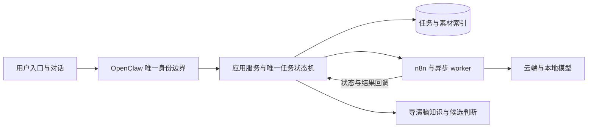

# 发布与长期维护演进

本方案保持现有用户功能、OpenClaw唯一鉴权和单一任务状态机。2026-09-06的首次蓝绿迁移尚未完成；下述后续阶段不代表已经在生产启用。

## 当前先完成的基础

首次迁移使用现有preinstall/bootstrap控制器及连续runner。保护按完成进度续期，单步保留超时和明确恢复入口。发布清单采用共享契约；安装、恢复、打包和来源验证必须使用一致的文件清单与限制。已完成阶段不得重放，不把修改旧证明或跳过实际数据操作当作提速。

当前架构继续采用模块化单体加异步worker：OpenClaw承担身份和薄入口，应用服务掌管业务与状态，n8n执行受管工作流，导演脑保存知识与候选判断。暂不拆分微服务或新增账号、队列、双写及另一套发布状态机。

权限统一沿OpenClaw边界，插件文件布局也遵循官方安装方式。项目侧的部署检查只验证来源、内容完整性、受管依赖和回滚证据；自有组件与官方安装组件通过各自明确的布局契约接入同一证据流程，避免复制一套更严格却不兼容的权限规则。

n8n 的端口监听、HTTP readiness 与完整工作流初始化是不同阶段。数据库 freeze 必须等待绑定本次进程的完整启动记录；进程重启后重新验证运行身份，不能修改已有 COMMITTED 证明。后续摘要解耦要把稳定的工作流内容与易变的进程身份分开，避免正常重启要求再次发布工作流。

图中执行链表示现有职责划分，不能据此启用仍被用户暂停的视频执行。蓝绿只替换应用运行版本，不创建第二条任务权威链。

## 优先改进顺序

| 阶段 | 改进 | 验收标准 |
| --- | --- | --- |
| 稳定基线 | 完成首次蓝绿迁移并记录应用、数据库schema、n8n、OpenClaw版本与回滚点 | 切换、健康、准入恢复和隔离对话证据真实齐备；原暂停视频lane保持原状态 |
| 影响说明 | CI输出各组件内容摘要及受影响测试分区 | 能解释每一步为何执行或复用；不因文档或其他组件变化误判业务改动 |
| 准备与激活分离 | n8n在线生成不可变候选，维护窗口仅执行必要的激活与迁移；应用使用统一安全收包入口 | 候选准备不改current、数据库或在线服务；激活使用原维护锁、备份和CAS；打包权限与成员审计自动完成 |
| 制品按内容复用 | 提交来源引用可复用组件制品，逐步解除整仓SHA对所有组件的强制重装 | n8n和插件内容未变时保留原物理制品；真实依赖变化会触发必要验证；attestation和回滚仍可追溯，不重标旧证明 |
| 日常蓝绿发布 | 正常应用更新只走候选验收、暂停新准入、路由切换、健康、恢复准入和旧槽排空 | 存量任务按release affinity完成；无需重新运行一次性的legacy冻结和bootstrap |
| 验证前移 | 在生产等价macOS隔离环境验证LaunchAgent、PID/FD、SQLite、socket及归档权限合同 | 生产仅复核当前身份、变更与切换结果；模拟测试不冒充真实系统合同证据 |

组件解耦必须同时设计来源证明、依赖摘要、兼容关系与回滚引用，不能仅去掉`SOURCE_COMMIT`相等检查。先以只读影响报告验证分类准确，再逐组件引入复用，避免一次改动重写整条发布链。

## 验证与执行效率

已通过且未受影响的验证直接复用，记录来源及适用范围。新增制品完整性、真实目标身份、改动功能和最终切换健康仍要核验。发现同类失败先统一根因，再运行有新增证据支持的定向验证；不逐错重建整个系统。

应用构建、独立制品传输和只读候选检查可并行；数据库写入、current选择、服务启停和路由切换由一个执行者串行管理。依赖与制品缓存按摘要校验后复用。耗时以阶段实际测量为准，不把固定等待当作成功证明。

两端 openrsync 的 `--copy-dest` 已用独立微型传输验证：相同文件可从远端旧制品复制，变化文件经 SSH 传输，目标保留字节、权限及相对链接且不与旧制品形成硬链接。正式使用必须落到全新隔离 staging，执行完整制品审核后才原子进入 `releases/<release-id>/standalone`；禁止对当前运行目录做增量覆盖。

298 制品已按该方式完成真实交付：增量传输 24.31 秒、20 个变化文件、网络发送 2,160,604 字节；完整 inventory 一致，无旧制品硬链接，成员审计没有禁入内容。该数字仅表示传输阶段，不能当成整次部署时间。后续分别记录准备、传输、维护、激活和验收耗时，并统计因同类合同错误导致的回滚次数，按实际瓶颈安排优化。

e8 交付暴露了执行参数漂移：实际使用 `-a` 而非已验证的 `-rlpcz`，没有按内容比较和压缩，最终全量发送 97,224,260 字节、耗时 749.55 秒。固定并记录实际 argv，保留 `-c/-z`、安全链接和独立暂存语义；预先检查进程资源预算，远端 SSH 默认软 FD 上限 256 对该树规模不足，已验证传输子进程 32768 可完成，系统全局限制保持原样。记录 donor 路径、匹配/传输文件数、字节量、预算和最终审核结果，不把硬链接数为零误当作没有复用，也不把中途暂存总字节增长直接当作有效完成进度。

测试适配器须走生产的共享编解码与校验路径。文件引用的完整元数据与简化内容引用用途不同，返回、持久化与消费必须使用同一契约；不能让测试分支手工返回正确对象而生产分支丢字段。围绕真实生成结果验证 prepare、确认、切换与恢复，优先修复数据流分叉，减少只测试手工旧样例造成的生产反复试错。

运行目录解析也必须由证据生成与部署消费共用，兼容既有 `<release>/.next/standalone` 与当前 standalone 布局，不能在后续阶段重新猜父目录。失败恢复应区分关闭许可和实际切换：本次已通过固定的进程、数据库、队列、工作流与 guard 证据核对，安全处理 pending 前的失败；后续可将该收尾流程固化。pending 出现后的失败仍走现有恢复控制器，不用伪造标记或删除授权记录提速。

网络故障应在安装前识别，正在进行的安装和恢复不得重复依赖公网。当前 video installer 已把正式 preinstall apply/rollback 的远端来源复核收敛为本地已绑定来源与原共享 reservation gate；首次 dry-run 仍验证 GitHub。网络恢复后的续接须先区分 UNPREPARED 与已绑定或已结束的 attempt：只有原 transition 尚无安装 owner 和 bootstrap claim 时，才可用新控制目录沿用同一 COMMITTED n8n。不能把换目录当成绕过不可变 owner 的办法。后续准备与激活分离应让网络检查在维护前完成，并以明确的来源摘要交接。

完成部署后的纯文档审计提交只进入 GitHub，不触发构建、工作流导入或服务重启。当前发布工具仍有整仓 HEAD 绑定，生产 canonical 应保留已验证的部署 SHA，保留同版本恢复能力；记录中分别注明 GitHub 文档版本与实际运行版本。下一次正式发布再一次性快进到包含审计记录的真实代码候选，不为纯文档提交生成运行时。

未来多人使用继续沿OpenClaw的唯一身份边界扩展权限和资源配额。仅当监测证明单体资源隔离或扩容能力不足时，再评估独立执行节点；不预先引入分布式事务及额外运维系统。

## 本轮恢复暴露的优先改进

停服前必须完成能前移的真实环境合同检查，包括当前运行证明、运行目录、进程与数据库文件身份、端口查询语义，以及接管所需的完整交接字段。需要停服后才能判断的条件仍保留最终校验，不能用准备阶段的历史结果代替当前事实。

日常发布与首次迁移应有独立命令边界：baseline 建立后，普通应用更新不再进入 legacy bootstrap，也不重新导入内容未变的 n8n 或重装插件。候选准备阶段完成网络、构建、完整制品审计和兼容性检查；维护窗口只做必要的身份复核、准入 CAS、激活、路由切换与健康检查。

真实 Darwin 系统行为必须进入小范围合同测试。此次 lsof 的空结果退出码、LaunchAgent 的执行上下文、进程 FD 预算和 openrsync 参数均不能靠通用 Linux 假设或手工正确对象代替。共享 helper 明确区分空结果与真实失败，原始错误在私有记录中保存或脱敏分类，禁止通过普遍吞错让校验失效。

恢复继续使用不可变历史授权和新的当前运行证明。单次应急适配有明确来源、精确作用范围和退出条件，不成为日常 PATH 依赖。后续应把 guard 就绪与交接纳入事件驱动的有界等待：以真实 ready、子进程存活和阶段进展判断，固定小延时不能被当成实际状态。

对效率的验收采用阶段实测：分别记录构建、传输、维护、激活、健康与恢复耗时；影响报告说明执行或复用依据。正确传输参数在 660 和 3db 两次交付均约 24 秒、发送约 2.2 MB，偏离参数的一次交付约 750 秒、发送约 97 MB。该比较只说明传输阶段，不外推整次发布耗时，也不把所有文件差异都归因为 mtime。

共享 OpenClaw、官方插件与应用部署也需要明确互斥边界。发生尚未完成的部署事务时，共享 SDK 升级会改变运行证明的前提；即使用户允许服务中断，也应保留原版本回退资产和不可变历史授权。升级方交付实际版本与基线、释放维护执行权后，部署方基于新环境重新判断兼容性，不并行生成互相失效的证明，也不覆盖旧证明来伪装兼容。

## 共享 SDK 升级后的恢复准备

共享维护任务已报告 OpenClaw core 升至 2026.9.2，三 profile 的插件与迁移维护仍在进行。本部署尚未恢复，不能把旧 2026.7.1-2 的运行证明、进程身份或 SDK 行为当作当前事实。此次升级已获用户明确授权；后续方向是接纳经过验证的新版运行时，保留新认证与网络配置。

只读审计将受影响部分归为四组：发行包与 CLI 版本；私有 Gateway RPC 入口加载；hooks、工具、config 与 health 的响应语义；SDK 链接、peer 和安装布局。收敛 manifest、shell 安装器和 Node 消费者需要使用同一批准合同，不能各自修改版本字符串。config CAS、磁盘摘要、受限字段变更和秘密投影仍须保留；私有打包入口必须按真实新版本验证，不能假定旧 dist 名称和导出继续有效。

当前旧 bootstrap 在处理 pending 前仍会执行固定旧 SDK 的 preflight，因此单独运行新版 validator 不足以恢复。需要先确定一个能明确区分旧应用/数据授权与新控制代码/运行证据的恢复入口；任何新增恢复桥都必须保留全部原始收据、记录来源与当前身份，并复用既有数据库、工作流、准入和路由约束。现有灾备续接已经消费的 capability 只作历史引用，不为准备新方案再次 derive 或 consume。该恢复桥目前尚未实现，不应作为现有命令调用。

下一步以共享维护方交回的真实插件清单、SDK 接口和运行基线选择兼容方案。应用与 n8n 制品可以保持其原已审核身份；插件是否保持原 payload 必须以实际结果判断。若新版插件需要不同 payload，应明确新来源和应用协议兼容性，不能假设仍等于旧提交，也不能通过降级或改写旧证明凑齐相等条件。

新增验证仅覆盖发生变化的 SDK、RPC、配置、工具/hook、安装与恢复交接合同。既有应用、n8n 和未变的系统启动证据按适用范围复用；维护完成前不做新的 Gateway 重启、运行证明生成、bootstrap 续接或正式启动配置写入。

恢复桥还应避免重现本轮的运行证明失效循环：一次性授权绑定稳定的 SDK 兼容合同、目标制品、插件来源和旧数据授权；当前 Gateway 身份与短时运行证明单独在每次执行边界验证。正常重启只更新当前运行证明，不改写历史授权，不因为新进程出现就重新消费旧能力。若控制合同、payload 或数据范围实质变化，则明确形成新的兼容依据；不能把普通重启与目标变更混为一谈。该项目前为设计要求，尚未据此生成或消费任何新能力。

公开 9.2 SDK 已从实际安装源码确认提供 `openclaw/plugin-sdk/gateway-runtime`，包含 `GatewayClient` 和 `callGatewayFromCli`，后者可直接接收参数对象。项目可由唯一 Node 适配器读取权限受控的参数文件后调用该公开入口，替代内部 dist 文件扫描；官方 `gateway call` 当前只公开内联 JSON 参数，不应臆造参数文件或 stdin 选项。此处为源码接口证据，尚未运行 9.2 RPC 行为验证。

3db 应用源码没有 7.1 的字面版本限制，但其已打包的 CLI、WebSocket 和文件解析不会自动使用新的公开 SDK。保留该制品前，应定向核对 Gateway v4 握手/v3 签名与权限 scope、agent/session RPC、n8n 模型命令及结果、配置中的认证与 SecretRef、session/transcript 文件布局。只有发现具体应用消费者不兼容时才针对性修改并重建；控制工具的版本变化本身不构成应用重建依据。session 清理、配置写入等分支只在脱敏副本或隔离环境验证，不能用真实生产记录试删或改写。

后续公开源码核对显示 9.2 仍使用客户端协议 v4、v3 Ed25519 设备签名、control-ui 标识、operator.admin scope 和 device token；agent CLI 仍声明所需 session-key、message-file 和 model 参数。3db 的 expect-final 位于正确的 gateway call 命令，结果解析也已覆盖嵌套 result.payloads。这些静态证据支持先保留制品、再做针对性真实验证的顺序，尚不等于完成生产握手或业务验收。

## 2026-09-10 日常增量发布入口

`node scripts/release-impact-deploy.mjs plan --source-commit <SHA> --artifact <目录> --output <计划文件>` 生成计划，`node scripts/release-impact-deploy.mjs apply --plan <计划文件>` 执行选中的变更，产品工作目录保持根目录下的 `video-autoworker/`。计划比较生产来源与目标来源的组件内容，并核对已安装控制工具；应用业务改动只构建、暂存和切换应用。仅实际变化的插件调用对应安装器，控制工具变化执行独立的一次维护。

飞书业务统一经应用接口处理，OpenClaw插件不携带业务服务副本。稳定投影协议与实现源码摘要分别负责兼容和完整性，因此常规实现更新不再强制插件升级。38条历史证据的回执恢复是指定对象的幂等维护动作，不是所有新版本的前置步骤。验证范围遵循 `VAW-FOCUSED-VALIDATION-001`，只验本次功能和直接影响，完整套件须显式选择。
